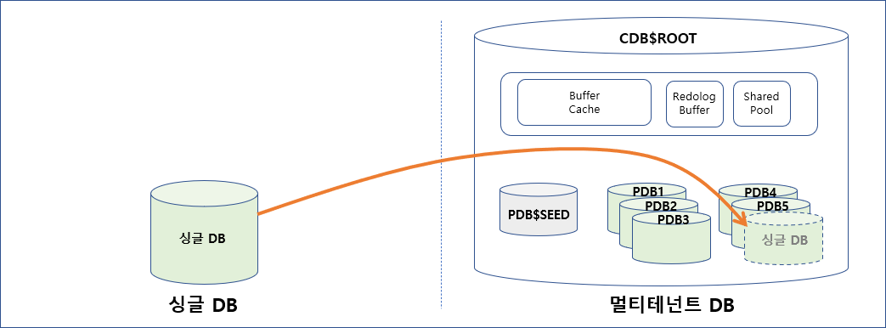
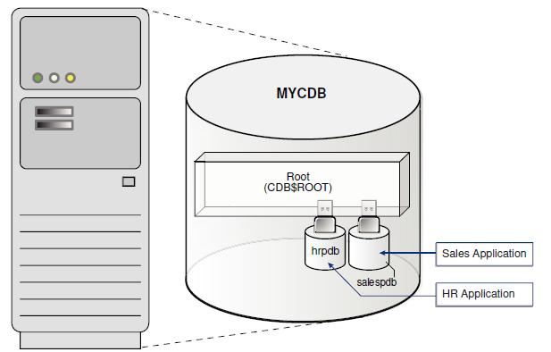

# 3-1.CDB 와 PDB

- Oracle 12c 부터 Multi-Tenant 기능을 제공
- 해당 기능을 간략히 설명하자면, CDB (Container Database) 안에 여러 PDB (Pluggable Database)를 사용할 수 있는데 
- 컨테이너 안에 여러 개의 PDB 를 생성하여 Unplug 또는 Plug 하며 효과적으로 DB를 운영할 수 있음
- 쉽게 말해서 "DB 안에 여러 DB들이 들어가 있는 구조" 이다
- 여러 개의 데이터베이스를 생성하여 운영하는 것보다 메인테넌트 기능을 사용하면 리소스를 효율적으로 사용할 수 있을 것 같음.
- (보통 1개의 데이터 베이스 당 프로세스 할당 갯수가 53 ~54 정도 되는데 메인테넌트 기능을 이용하면 PDB 추가 할 때마다 프로세스가 1~2개 정도만 증가함.)

- 보통 클라우드라고 하면 인터넷망을 통해 접근하는 것만 생각하는데, 이런 것을 "Public Cloud" 라고 하고,
- 우리 전산실내에서 폐쇄적으로(인터넷망을 거치지 않고) 구축한 클라우드를 "Private Cloud" 라고 구분하고 있다.
- 이 멀티테넌트의 개념은 Private Cloud 형태를 DBMS 내에 구축했다고 보면 된다
- Multi-Tenant 라는 단어에서 Multi 는 "여러개" 의 뜻이고, Tenant 는 "세입자" 라는 뜻이다.
- 여러 세입자(DB)가 큰 집에 모여산다는 개념이다

- MYCDM 라는 큰 DB  안에 hrpdb 와 salespdb 2개의 DB 가 존재한다.
- 밖에서는 MYCDB 1개의 DB 만 보이지만 사용자 입장에서는 내부에 2개의 별도 DB 가 존재하는 것이다
- hrpdb 에서 salespdb 로 직접 들여다보거나 데이터 변경이 안되므로 논리적으로 서로 다른 DB 이다.
- hrpdb, salepdb 와 같이 셋방살이 하고 있는 세입자(tenant) DB들을 유식한 말로 PDB (Pluggable DB) 라고 합니다.
- MYCDB 처럼 hrpdb, salespdb 를 담고 있는(contain) 집주인 DB를 유식한 말로 CDB (Container DB) 라고 합니다. 
- DB 를 USB 처럼 꼽압다(plug) 뽑기(plug) 편하기 때문에 pluggable 를 활용한다.
- 결론적으로 Multi-Tenant 는 DB 통합, Private Cloud 구축에 매우 유용한 기능이다.

## 참고 사이트
https://jack-of-all-trades.tistory.com/286