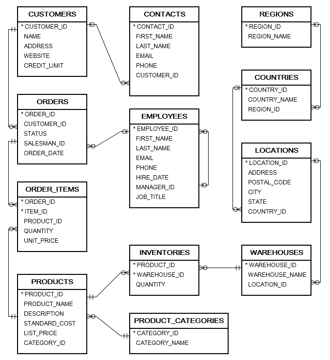
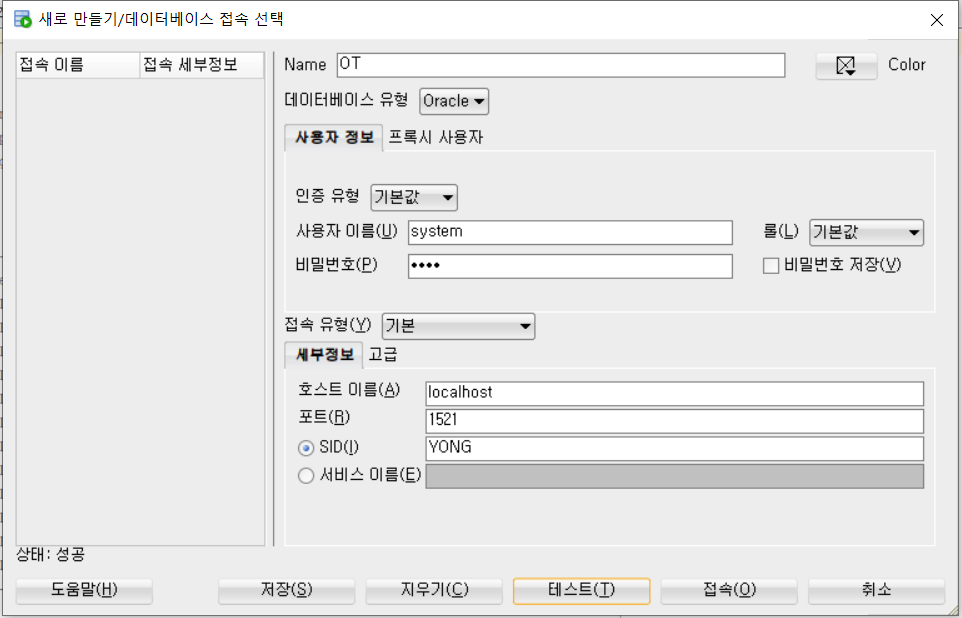

# 3.Oracle 유저 생성 및 Sample Data 주입

## User 생성 및 권한 부여
```
docker exec -it oracle sqlplus
user-name : system
password : 1234
```
oracle db 에 접속시 container database(CDB) 에 접속하게 된다
- 초기 이름은 ROOT 이다.
```oracle-sql
SQL> SHOW con_name;

CON_NAME
------------------------------
CDB$ROOT
```

pluggable database 로 switch 해야 한다. 우리는 docker 설정 시 ORACLE_PDB 로 YONGPDB 를 지정하였다.
```oracle-sql
SQL> ALTER SESSION SET CONTAINER = YONGPDB;

Session altered.
```
show 를 사용하면 현재 DB 는 CDB 내부에 우리가 설정한 PDB 인 YONGPDB 인 것을 확인할 수 있다.
```oracle-sql
SQL> SHOW con_name;

CON_NAME
------------------------------
YONGPDB
```
새로운 유저를 생성하기 전에 DB 를 open 해야 한다.
```oracle-sql
SQL> ALTER DATABASE OPEN;

Database altered.
```
pluggable DB 안에 새로운 유저를 만들자(id: yong, pw: 1234)
```oracle-sql
SQL> CREATE USER yong IDENTIFIED BY 1234;

User created.
```
유저에게 권한을 부여하자
```oracle-sql
SQL> GRANT CONNECT, RESOURCE, DBA TO yong;

Grant succeeded.
```
이제 user 라는 사용자를 통해 PDB 에 접속할 수 있따.
```oracle-sql
SQL> CONNECT yong@YONGPDB
Enter password:
Connected.
```

## Sample 데이터 생성 및 주입
[Download Oracle Sample Database](https://www.oracletutorial.com/wp-content/uploads/2019/01/oracle-sample-database.zip)

### Sample Data ERD


- `ot_create_user.sql` is for creating OT user and grant privileges
- `ot_schema.sql` is for creating database objects such as tables, constraints, etc.
- `ot_data.sql` is for loading data into the tables.
- `ot_drop.sql` is for removing all objects in the sample database.

### table 생성 및 데이터 주입


테이블을 만들기 위해 `ot_schema.sql` 를 실행해야한다<br>
SQL*plus 에서 파일에 있는 SQL statements 를 실행하기 위해 다음과 같은 형식으로 커맨드를 작성해햐 한다.
```oracle-sql
SQL>@path_to_sql_file
```

`ot_schema.sql` 가 있는 위치를 기반으로 sql 를 실행한다
```oracle-sql
SQL>@C:\Users\user\Desktop\oracle-sample-database\ot_schema.sql
```

### 만약 SP2-0310 에러가 발생한다면? : 
sql developer 를 키고 sql 를 옮겨서 실행하자


```oracle-sql
SQL> SELECT table_name FROM user_tables ORDER BY table_name;

TABLE_NAME
--------------------------------------------------------------------------------
CONTACTS
COUNTRIES
CUSTOMERS
EMPLOYEES
INVENTORIES
LOCATIONS
ORDERS
ORDER_ITEMS
PRODUCTS
PRODUCT_CATEGORIES
REGIONS
WAREHOUSES

12 rows selected.
```

생성된 테이블에 데이터를 불러온다
```oracle-sql
SQL>@C:\Users\user\Desktop\oracle-sample-database\ot_data.sql
```

#### ================ 주의 ================
실행시 오류가 발생한다면 `ot_data.sql` 내부 데이터를 일부 변경해야 한다. 
```
OT. -> <br>
DD-MON-RR' -> DD-MON-RR','NLS_DATE_LANGUAGE=AMERICAN'
```
#### ================ 주의 ================

- 데이터 일부 변경이 필요하다
- OT. 의 경우 인식을 못해 insert 가 안되므로 OT. 을 전부 제거한다
- DD-MON-RR 의 경우 실습환경에 따라 다른데 한국 환경은 `to_date('21-1월-01','DD-MON-RR')` 만 인식하므로 영어 환경으로 설정을 변경한다.
- 변경 데이터는 sample_data 폴더에도 존재한다.
#### ================ 주의 ================

성공적으로 데이터를 불러왔는지 테스트하자
```oracle-sql
SQL> SELECT COUNT(*) FROM contacts;

  COUNT(*)
----------
       319
```

생성된 테이블을 전부 지우고 싶다면?
```oracle-sql
drop table CONTACTS CASCADE CONSTRAINTS ;
drop table COUNTRIES CASCADE CONSTRAINTS ;
drop table CUSTOMERS CASCADE CONSTRAINTS ;
drop table EMPLOYEES CASCADE CONSTRAINTS ;
drop table INVENTORIES CASCADE CONSTRAINTS ;
drop table LOCATIONS CASCADE CONSTRAINTS ;
drop table ORDERS CASCADE CONSTRAINTS ;
drop table ORDER_ITEMS CASCADE CONSTRAINTS ;
drop table PRODUCTS CASCADE CONSTRAINTS ;
drop table PRODUCT_CATEGORIES CASCADE CONSTRAINTS ;
drop table REGIONS CASCADE CONSTRAINTS ;
drop table WAREHOUSES CASCADE CONSTRAINTS ;
```