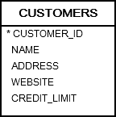
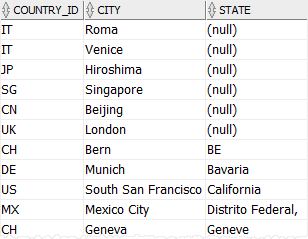
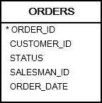

# 1. Sorting data - ORDER BY

## syntax
```oracle-sql
SELECT
    column_1,
    column_2,
    column_3,
    ...
FROM
    table_name
ORDER BY
    column_1 [ASC | DESC] [NULLS FIRST | NULLS LAST],
    column_1 [ASC | DESC] [NULLS FIRST | NULLS LAST],
    ... 
```
- `ASC` for sorting in ascending order(오름차순)
- `DESC` for sorting in descending order(내림차순)
- `NULLS FIRST` : NULL 값 먼저
- `NULLS LAST` : NULL 값 뒤쪽으로
- 주의 : ORDER BY 절은 항상 SELECT 문의 마지막 절입니다.

## practice


### A) Sorting rows by a column example
```oracle-sql
SELECT
    name,
    address,
    credit_limit
FROM
    customers
ORDER BY
    name ASC;
```
- name 으로 오름차순 정렬
- ASC 는 default 값이다. 따라서 ASC 생략 시 ORDER BY 는 오름차순 정렬을 한다.

```oracle-sql
ORDER BY name ASC

ORDER BY name
```
- 둘은 동일하다

```oracle-sql
SELECT
    name,
    address,
    credit_limit
FROM
    customers
ORDER BY
    name DESC;
```
- 이름 기준으로 내림차순 정렬이다

### B) Sorting rows by multiple columns example
- ORDER BY 에서 , 로 컬럼을 구분한다.
```oracle-sql
SELECT
	first_name,
	last_name
FROM
	contacts
ORDER BY
	first_name,
	last_name DESC;
```
- `first_name` 으로 오름차순 후 `last_name` 으로 내림차순정렬한다.

### C) Sort rows by column’s positions example
- 이름을 명시하지 않고 positions 를 사용할 수 있다.
```oracle-sql
SELECT
    name,
    credit_limit
FROM
    customers
ORDER BY
    2 DESC,
    1;
```
- `name` 은 1이고, `credit_limit` 은 2이다.

### C) Sorting rows with NULL values examples

````oracle-sql
SELECT
    country_id,
    city,
    state
FROM
    locations
ORDER BY
    city,
    state;
````


- 다음과 같은 결과를 얻는다.
- null 과 non-null 이 섞여 나올때 oracle 은 어느것을 먼저 나오게 할지 설정할 수 있다.
```oracle-sql
SELECT
    country_id,
    city,
    state
FROM
    locations
ORDER BY
    state ASC NULLS FIRST;
```

- NULL 을 마지막에 나오게 할 수도 있다.
```oracle-sql
SELECT 
   country_id, 
   city, 
   state 
FROM 
   locations 
ORDER BY 
   state 
ASC NULLS LAST;
```

### D) Sorting rows by the result of a function or expression
- order by 는 string function 나 math function 를 실행한 결과값으로 정렬할 수도 있다.
- 예를 들어 `UPPER()` 함수를 사용하면 대문자 기준으로 정렬한다.
```oracle-sql
SELECT
	customer_id,
	name
FROM
	customers
ORDER BY
	UPPER( name );
```

### E) Sorting by date example


- 날짜로도 정렬 가능하다
```oracle-sql
SELECT 
   order_id, 
   customer_id, 
   status, 
   order_date
FROM 
   orders
ORDER BY 
   order_date DESC;
```
