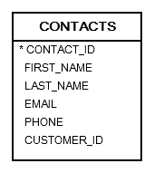
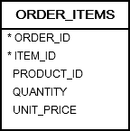
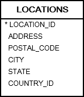

# 1. DISTINCT
- `DISTINCT` 는 `SELECT` 문에서 사용되며 결과 set 에서 중복되는 rows 를 filter 하는 역할을 한다.

## syntax
```oracle-sql
SELECT DISTINCT column_1
FROM table;
```
- 단건 column 적용
```oracle-sql
SELECT
    DISTINCT column_1,
    column_2,
    column_3
FROM
    table_name;
```
- multiple column 적용

## practice
### A) Oracle SELECT DISTINCT one column example


```oracle-sql
SELECT
  first_name
FROM
  contacts
ORDER BY
  first_name; 
```
- 결과로 319 rows 를 반환한다.

```oracle-sql
SELECT DISTINCT
  first_name
FROM
  contacts
ORDER BY
  first_name;
```
- 결과로 302 rows 를 반환한다. 중복되는 17 rows 는 제거되었다.

### B) Oracle SELECT DISTINCT multiple columns example

```oracle-sql
SELECT
    DISTINCT product_id,
    quantity
FROM
    ORDER_ITEMS
ORDER BY
    product_id;
```
- product_id 와 quantity 둘다 unique 값을 찾는데 사용되었다.
- id 와 quantity 가 동일할 경우 제거된다.
- 따라서 DISTINCT 를 quantity 에 걸어도 동일한 개수의 rows 가 출력된다.
- _여기서 주의할 점은 DISTINCT 위치는 반드시 SELECT 문 바로 뒤에 와야 한다_.

### C) Oracle SELECT DISTINCT and NULL

- DISTINCT는 NULL 값을 서로 중복된 값으로 처리한다.
- SELECT DISTINCT 문을 사용하여 NULL 값이 많은 열에서 데이터를 쿼리하는 경우 결과 집합에는 NULL 값이 하나만 포함됩니다.

```oracle-sql
SELECT
    DISTINCT state
FROM
    locations
ORDER BY
    state NULLS FIRST;
```

#### 일부 열에는 DISTINCT를 적용하고 다른 열은 건너뛰려면 GROUP BY 절을 사용해야 한다.