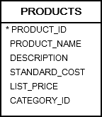
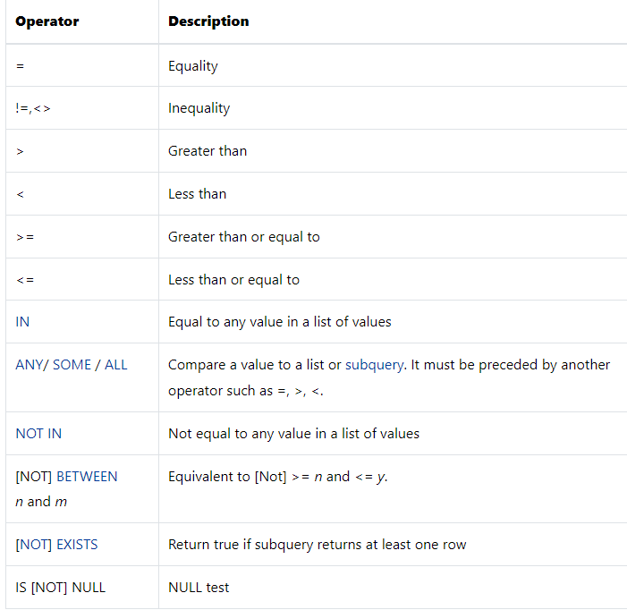

# 2. Where
- where 절은 select 문의 결과에 특정 조건을 걸 때 사용된다.

## syntax
```oracle-sql
SELECT
    select_list
FROM
    table_name
WHERE
    search_condition
ORDER BY
   sort_expression;
```

## practice


### A) Selecting rows by using a simple equality operator
```oracle-sql
SELECT
    product_name,
    description,
    list_price,
    category_id
FROM
    products
WHERE
    product_name = 'Kingston';
```

### B) Select rows using comparison operator


```oracle-sql
SELECT
    product_name,
    list_price
FROM
    products
WHERE
    list_price > 500;
```

### C) Select rows that meet some conditions
AND, OR 및 NOT 논리 연산자를 이용해 조건을 결합합니다.
```oracle-sql
SELECT
    product_name,
    list_price
FROM
    products
WHERE
    list_price > 500
    AND category_id = 4;
```

### D) Selecting rows that have a value between two values
두 값 사이에 값이 있는 행을 찾으려면 WHERE 절에서 BETHERT 연산자를 사용합니다.
```oracle-sql
SELECT
    product_name,
    list_price
FROM
    products
WHERE
    list_price BETWEEN 650 AND 680
ORDER BY
    list_price;
```
아래 두 조건은 동일하다
```oracle-sql
list_price BETWEEN 650 AND 680
list_price >= 650 AND list_price <= 680
```

### E) Selecting rows that are in a list of values
리스트에는 in 을 사용할 수 있다.
```oracle-sql
SELECT
    product_name,
    category_id
FROM
    products
WHERE
    category_id IN(1, 4)
ORDER BY
    product_name;
```
- category_id 가 1 과 4인 값들을 불러온다.
- 아래 두 조건은 동일하다
```oracle-sql
category_id IN (1, 4)
category_id = 1 OR category_id = 4
```

### F) Selecting rows which contain value as a part of a string
문자열은 LIKE 를 활용할 수 있다.
```oracle-sql
SELECT
	product_name,
	list_price
FROM
	products
WHERE
	product_name LIKE 'Asus%'
ORDER BY
	list_price;
```