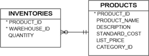
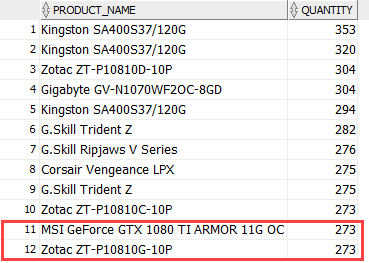
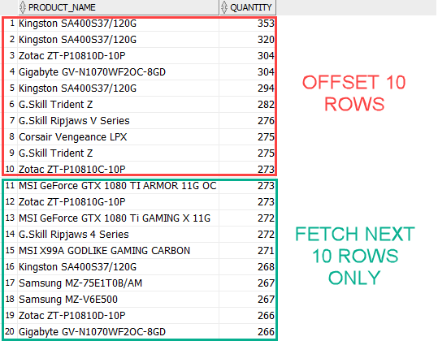

# 4. FETCH
- `FETCH` 는 쿼리결과로 나온 rows 를 제한하는 기능이다
- MySQL, PostgreSQL 와 같은 RDBMS 는 `LIMIT` 구문을 통해 rows 를 제한 할 수 있다.

## practice


### Introduction to Oracle FETCH clause
```oracle-sql
SELECT
	product_name,
	quantity
FROM
	inventories
INNER JOIN products
		USING(product_id)
ORDER BY
	quantity DESC 
LIMIT 5;
```
- Mysql 문법으로 오라클에서는 실행되지 않는다.
- 가장 quantity 양의 많은 5개의  rows 를 가지고 온다.

```oracle-sql
SELECT
    product_name,
    quantity
FROM
    inventories
INNER JOIN products
        USING(product_id)
ORDER BY
    quantity DESC 
FETCH NEXT 5 ROWS ONLY;
```
- 오라클은 12c 부터 `LIMIT` 과 비슷하지만 더 유연한 기능인 `FETCH`를 도입하였다.
- 가장 quantity 양의 많은 5개의  rows 를 가지고 온다.

### Oracle FETCH clause syntax
```oracle-sql
[ OFFSET offset ROWS]
 FETCH  NEXT [  row_count | percent PERCENT  ] ROWS  [ ONLY | WITH TIES ] 
```
#### OFFSET
- `offset` 은 행 fetch 가 시작될때 건너뛸 행의 수를 지정한다.
- `offset` 은 선택사항입니다. 적지 않는다면 `offset` 은 0 이 되며 자동으로 첫번째 행부터 시작된다.
- `offset` 은 숫자이거나 숫자로 표현되어야 하며, 규칙은 다음과 같다
  - 오프셋이 음수이면 0으로 처리됩니다. 
  - 오프셋이 NULL이거나 쿼리에서 반환된 행 수보다 큰 경우 행이 반환되지 않습니다. 
  - 오프셋에 분수가 포함되어 있으면 소수 부분이 잘립니다.

#### FETCH 
- 반환할 행의 수 또는 행의 비율을 지정한다.
- 의미를 명확하게 하기 위해 `ROWS`대신 `ROW`, `NEXT`대신 `FIRST` 를 사용할 수 있다.
- 아래 2 구문은 동일한 의미이다.
```oracle-sql
FETCH NEXT 1 ROWS
FETCH FIRST 1 ROW
```

####  ONLY | WITH TIES
- `ONLY` 는  `FETCH NEXT` OR ` FIRST` 이후 정확히 반환할 rows 의 개수 혹은 비율을 반환하게 한다.
- `WITH TIES`는 가져온 마지막 row 와 동일한 정렬 키를 가진 추가 row 를 반환한다.
- 따라서 `WITH TIES` 를 적는다면, 반드시 `ORDER BY` 절을 명시해야 한다. 그렇지 않으면 쿼리는 추가적인 rows 를 반환하지 않는다.

### A) Top N rows example
```oracle-sql
SELECT
    product_name,
    quantity
FROM
    inventories
INNER JOIN products
        USING(product_id)
ORDER BY
    quantity DESC 
FETCH NEXT 10 ROWS ONLY;
```

### B) WITH TIES example
```oracle-sql
SELECT
	product_name,
	quantity
FROM
	inventories
INNER JOIN products
		USING(product_id)
ORDER BY
	quantity DESC 
FETCH NEXT 10 ROWS WITH TIES;
```

- 10개 row 를 fetch 했지만, 실제로 12개가 fetch 되었다.
- 이는 order by quantity 를 했을때 10번째와 같은 quantity 의 row 가 추가로 존재하기 때문이다.

### C) Limit by percentage of rows example
```oracle-sql
SELECT
    product_name,
    quantity
FROM
    inventories
INNER JOIN products
        USING(product_id)
ORDER BY
    quantity DESC 
FETCH FIRST 5 PERCENT ROWS ONLY;
```
- 가장 quantity 가 많은 상위 5% 의 rows 를 반환한다.

### D) OFFSET example
```oracle-sql
SELECT
	product_name,
	quantity
FROM
	inventories
INNER JOIN products
		USING(product_id)
ORDER BY
	quantity DESC 
OFFSET 10 ROWS 
FETCH NEXT 10 ROWS ONLY;
```
- quantity 가 많은 10개의 rows 를 fetch 할때 우선적인 10개를 skip 한후 10개를 뽑는다
- 

