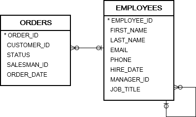
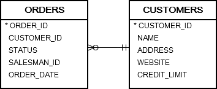

# 5. IN
- `IN` 은 list 나 subquery 에 매칭되는 값이 있는지 결정하는 operator 이다

## syntax
```oracle-sql
expression [NOT] IN (v1,v2,...)

expression [NOT] IN (subquery)
```
- expression : 보고싶은 column in table
- v1, v2, v3 .. : match 되는 값들. 모든 값들은 동일한 data type 이어야 한다.
- subquery : subquery 는 일치여부를 확인하기 위해 한 column 의 결과 집합을 반환한다. 열의 data type 은  expression 과 동일해야 한다.
- return value : expression 의 값들이 list 혹은 subquery 실행 값들과 동일하면 true, 아니면 false 를 반환한다.
- NOT 은 반대로 적용한다.

## practice


### A) Oracle IN examples
```oracle-sql
SELECT
    order_id,
    customer_id,
    status,
    salesman_id
FROM
    orders
WHERE
    salesman_id IN (
        54,
        55,
        56
    )
ORDER BY
    order_id;
```

```oracle-sql
SELECT
    order_id,
    customer_id,
    status,
    salesman_id
FROM
    orders
WHERE
    status IN(
        'Pending',
        'Canceled'
    )
ORDER BY
    order_id;
```

### B) Oracle NOT IN example
```oracle-sql
SELECT
    order_id,
    customer_id,
    status,
    salesman_id
FROM
    orders
WHERE
    status NOT IN(
        'Shipped',
        'Canceled'
    )
ORDER BY
    order_id;
```

### C) Oracle IN subquery example
```oracle-sql
SELECT
    employee_id,
    first_name,
    last_name
FROM
    employees
WHERE
    employee_id IN(
        SELECT
            DISTINCT salesman_id
        FROM
            orders
        WHERE
            status = 'Canceled'
    );
ORDER BY
    first_Name;
```
- employee_id 와 subquery 의 결과값의 data type 은 동일해야 한다.

### D) Oracle NOT IN subquery example


```oracle-sql
SELECT
    customer_id,
    name
FROM
    customers
WHERE
    customer_id NOT IN(
        SELECT
            customer_id
        FROM
            orders
    );  
```

### E) Oracle IN vs. OR
```oracle-sql
    salesman_id IN(
        60,
        61,
        62
    )
-----------
    salesman_id = 60
    OR salesman_id = 61
    OR salesman_id = 62
```
- 위 2개는 동일한 조건이다

```oracle-sql
    salesman_id NOT IN (60,61,62);
-----------
    salesman_id != 60
    AND salesman_id != 61
    AND salesman_id != 62;
```
- 위 2개는 동일한 조건이다