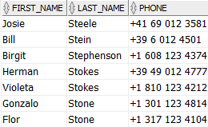
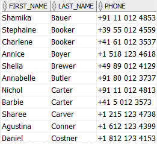
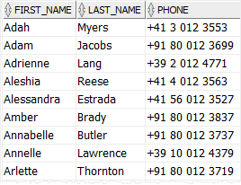
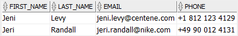
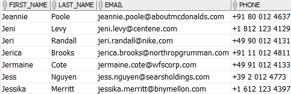
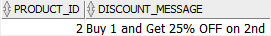

# 7. LIKE
- 문자열을 찾을 떄 사용된다.

## syntax
```oracle-sql
expresion [NOT] LIKE pattern [ ESCAPE escape_characters ] 
```
- expression : 테스트하려는 column 이름 또는 표현식
- pattern : 2개의 와일드카드가 있다.
  - % : 0개 이상의 문자로 구성된 모든 문자열과 일치합니다.
  - _ : 모든 단일 문자와 일치합니다.
- escape_characters
  - 와일드 카드가 와일드카드가 아닌 일반 문자로 해석되도록 지정하기 위해 와일드 카드 문자 앞에 표시되는 문자이다.
  - 지정된 한 문자여야 하며 기본갑이 없다.
- `LIKE` operator 의 반환값으로 expression 과 pattern 이 동일하면 true 를 반환한다. 아니면 false 반환한다.
- NOT 은 LIKE 연산자의 결과를 부정한다.

## practice


### A) % wildcard character examples
```oracle-sql
SELECT
    first_name,
    last_name,
    phone
FROM
    contacts
WHERE
    last_name LIKE 'St%'
ORDER BY
    last_name;
```
- St 로 시작하는 모든 last_name 을 불러온다


```oracle-sql
SELECT
    first_name,
    last_name,
    phone
FROM
    contacts
WHERE
    last_name LIKE '%er'
ORDER BY
    last_name;
```
- er 로 끝나는 모든 last_name 을 불러온다


```oracle-sql
UPPER( last_name ) LIKE 'ST%'

LOWER(last_name LIKE 'st%'
```
- 위와 같이 함수를 적용할 수도 있다.

```oracle-sql
SELECT
  first_name, last_name, phone
FROM
  contacts
WHERE
  phone NOT LIKE '+1%'
ORDER BY
  first_name;
```
- 핸드폰 번호가 +1 로 시작하지 않는 값들을 가지고 온다.


### B) _ wildcard character examples
```oracle-sql
SELECT
    first_name,
    last_name,
    email,
    phone
FROM
    contacts
WHERE
    first_name LIKE 'Je_i'
ORDER BY 
    first_name;
```
- `_` 는 1개의 문자만 의미한다.


### C) Mixed wildcard characters example
```oracle-sql
SELECT
    first_name,
    last_name,
    email,
    phone
FROM
    contacts
WHERE
    first_name LIKE 'Je_%';
```
- `_` 와 `%` 를 섞어쓸수 있다
- 위 조건은 Je 로 시작하고 최소 3개 이상의 first_name 을 의미한다.



### D) ESCAPE clause examples
- `ESCAPE` 는 하나 이상의 와일드카드 문자가 포함된 문자열을 찾을 수 있다.
- 할인률과 같이 % 가 데이터에 포함될 수 있다.
- 이런경우 다음과 같이 25% 를 사용한다
```oracle-sql
LIKE '%25!%%' ESCAPE '!'
```
- 테스트를 하기 위해 데이터를 넣어보자
```oracle-sql
CREATE TABLE discounts
  (
    product_id NUMBER, 
    discount_message VARCHAR2( 255 ) NOT NULL,
    PRIMARY KEY( product_id )
  );


INSERT INTO discounts(product_id, discount_message)
VALUES(1,
       'Buy 1 and Get 25% OFF on 2nd ');

INSERT INTO discounts(product_id, discount_message)
VALUES(2,
       'Buy 2 and Get 50% OFF on 3rd ');


INSERT INTO discounts(product_id, discount_message)
VALUES(3,
       'Buy 3 Get 1 free');
```

```oracle-sql
SELECT
	product_id,
	discount_message
FROM
	discounts
WHERE
	discount_message LIKE '%25!%%' ESCAPE '!';
```
