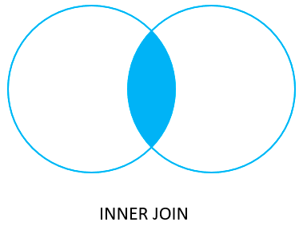
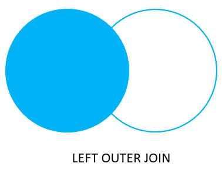
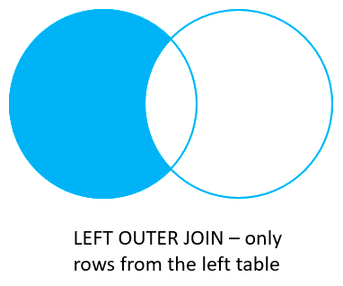
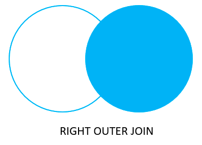
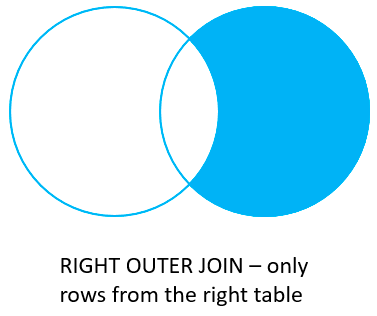
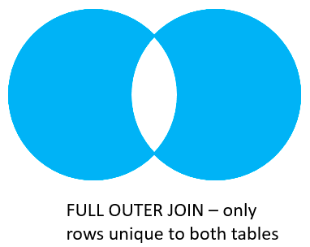

# 1. A visual explanaton of Oracle joins
- join 은 두개 이상의 테이블의 columns 들을 관련된 columns 를 바탕으로 합치는 것을 의미한다.
- 관련 열은 일반적으로 첫 번째 테이블의 Primary key 열과 두 번째 테이블의 Foreign key 열입니다.
- Oracle 은 `inner join`, `left join`, `right join`, `full outer join`, `cross join` 을 지원한다.

## Oracle inner join

## Oracle left join

## Oracle right join

## Oracle full outer join

