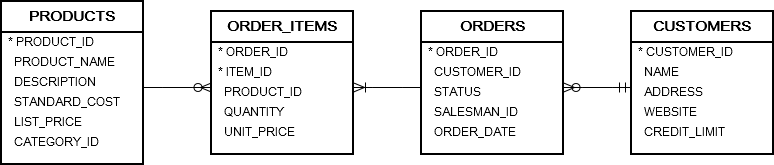

# 2. INNER JOIN


## syntax
```
SELECT
  *
FROM
  T1
INNER JOIN T2 ON join_predicate;
```
- T1 : main table
- T2 : joined table
- join_predicate : condtion for joining table

## practice
```oracle-sql
SELECT
    *
FROM
    orders
INNER JOIN order_items ON
    order_items.order_id = orders.order_id
ORDER BY
    order_date DESC;
```

### Oracle INNER JOIN with USING clause
- on 절 외에도 using 절을 사용하여 테이블을 조인 시 동등성을 테스트할 열을 지정할 수 있다.

```oracle-sql
SELECT
  *
FROM
  T1
INNER JOIN T2 USING( c1, c2, ... );
```
- c1, c2 는 T1, T2 에 모두 사용 가능해야 한다.

```oracle-sql
SELECT
  *
FROM
  orders
INNER JOIN order_items USING( order_id )
ORDER BY
  order_date DESC;
```

### Oracle INNER JOIN– 여러 테이블 조인


- inner join 은 세개 이상의 테이블을 조인할 수 있다.
- 성능 문제를 방지하려면 조인된 테이블의 수를 제한해야 한다.

```oracle-sql
SELECT
  name AS customer_name,
  order_id,
  order_date,
  item_id,
  quantity,
  unit_price
FROM
  orders
INNER JOIN order_items USING(order_id)
INNER JOIN customers USING(customer_id)
ORDER BY
  order_date DESC,
  order_id DESC,
  item_id ASC;
```

```oracle-sql
SELECT
	name AS customer_name,
	order_id,
	order_date,
	item_id,
	product_name,
	quantity,
	unit_price
FROM
	orders
INNER JOIN order_items
		USING(order_id)
INNER JOIN customers
		USING(customer_id)
INNER JOIN products
		USING(product_id)
ORDER BY
	order_date DESC,
	order_id DESC,
	item_id ASC;
```