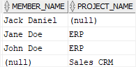

# 5. FULL OUTER JOIN
## syntax
```oracle-sql
SELECT
    select_list
FROM
    T1
FULL OUTER JOIN T2 ON join_condition;
```


## practice

```oracle-sql
CREATE TABLE projects(
    project_id INT GENERATED ALWAYS AS IDENTITY PRIMARY KEY,
    project_name VARCHAR2(100) NOT NULL
);

CREATE TABLE members(
    member_id INT GENERATED ALWAYS AS IDENTITY PRIMARY KEY,
    member_name VARCHAR2(100) NOT NULL,
    project_id INT,
    FOREIGN KEY (project_id) REFERENCES projects(project_id)
);

INSERT INTO projects(project_name) 
VALUES('ERP');

INSERT INTO projects(project_name) 
VALUES('Sales CRM');

INSERT INTO members(member_name, project_id)
VALUES('John Doe',1);

INSERT INTO members(member_name, project_id)
VALUES ('Jane Doe',1);

INSERT INTO members(member_name, project_id)
VALUES ('Jack Daniel',null);
```
- 실습을 위해 members 와 projects 테이블을 만든 후 
- 데이터를 집어 넣는다

```oracle-sql
SELECT 
    member_name, 
    project_name
FROM 
    members m
FULL OUTER JOIN projects p ON p.project_id = m.project_id
ORDER BY 
    member_name;    
```


- 결과는 다음과 같다.

```oracle-sql
SELECT 
    project_name,
    member_name
FROM 
    members m
    FULL OUTER JOIN projects p 
        ON p.project_id = m.project_id
WHERE 
    member_name IS NULL
ORDER BY 
    member_name; 
```
- where 절을 추가하여 member_name 가 없는 프로젝트만 조회 할 수 있다.

```oracle-sql
SELECT 
    member_name, 
    project_name
FROM 
    members m
    FULL OUTER JOIN projects p 
        ON p.project_id = m.project_id
WHERE 
    project_name IS NULL
ORDER BY 
    member_name;  
```
- where 절을 추가하여 project 에 참여하지 않는 멤버를 조회 할 수 있다.
