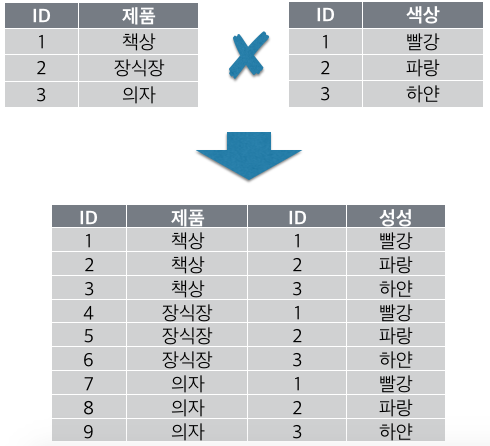
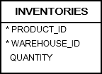

# 6. CROSS JOIN
## syntax
```oracle-sql
SELECT
    column_list
FROM
    T1 
CROSS JOIN T2; 
```
- cross join 은 두 테이블의 데이터의 모든 조합을 받아온다
- 다른 join 과 다르게 on 절이 join 에 붙지 않는다.
- 전혀 관련 없는 두개의 테이블을 cross join 하면 a*b 만큼의 개수로 table 을 join 한다
- cross join  은 주로 테스트를 하기 위해 많은 row 를 생성하는 경우에 유용하다.



## practice



```oracle-sql
SELECT
    product_id,
    warehouse_id,
    ROUND( dbms_random.value( 10, 100 )) quantity
FROM
    products 
CROSS JOIN warehouses;
```
- product 는 288 row warehouse 는 9 row 로 cross join 시 (288*9) 2592 rows 를 얻는다.
- 10 ~ 100 사이의 난수를 얻기 위해 dbms_random.value 함수를 사용하였다.

