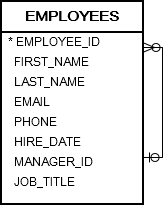

# 7. SELF JOIN
## syntax
```oracle-sql
SELECT
    column_list
FROM
    T t1
INNER JOIN T t2 ON
    join_predicate;
```
- self join 은 자신과 조인하는 join 이다
- 테이블 내의 행을 비교하거나 계층적인 데이터를 쿼리할 댸 유용하다.
- self join 은 inner join 혹은 left join 과 같은 다른 join 을 활용한다.
- table alias 별칭을 활용하여 같은 쿼리의 테이블에 다른 이름을 할당한다.

> self join 에서 테이블 별칭을 사용하지 않고 동일한 테이블을 2번 이상 참조하면 오류가 발생한다.


## practice



- 누구에게도 보고하지 않는 회사의 사장은 manager_id 가 null 이다
- 관리자가 있는 직원은 manager_id 에 관리자 id 가 표시된다.
- 테이블에서 직원 및 관리자 데이터를 검색할려면 employees 에서 self join 을 사용한다.

### A) Using Oracle self join to query hierarchical data example
```oracle-sql
SELECT
    (e.first_name || '  ' || e.last_name) employee,
    (m.first_name || '  ' || m.last_name) manager,
    e.job_title
FROM
    employees e
LEFT JOIN employees m ON
    m.employee_id = e.manager_id
ORDER BY
    manager;
```
- employee_id 와 manager_id 가 동일한 row 를 찾기 위해
- left join 과 alias 를 활용하여 self join  을 진행하였다.

### B) Using Oracle self join to compare rows within the same table example
```oracle-sql
SELECT
   e1.hire_date,
  (e1.first_name || ' ' || e1.last_name) employee1,
  (e2.first_name || ' ' || e2.last_name) employee2  
FROM
    employees e1
INNER JOIN employees e2 ON
    e1.employee_id > e2.employee_id
    AND e1.hire_date = e2.hire_date
ORDER BY  
   e1.hire_date DESC,
   employee1, 
   employee2;
```
- hire_date 가 동일한 모든 직원을 찾는 쿼리이다.


