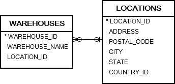

# 3. EXISTS and NOT EXISTS
# EXISTS
- exists 는 true 혹은 false 를 반환한다
- exists 는 보통 rows 의 존재를 확인하기 위해 subquery 와 함께 사용된다.

## syntax
```oracle-sql
SELECT
    *
FROM
    table_name
    WHERE
        EXISTS(subquery);
```
- 만약 subquery 가 any rows 를 반환하면 exits 는 true 를 반환한다. 아니면 false 를 반환한다.
- exists 는 subquery 가 첫번째 row 를 반환하면 subquery 의 processing 을 종료해버린다.

## practice


### Oracle EXISTS with SELECT statement example
```oracle-sql
SELECT
    name
FROM
    customers c
WHERE
    EXISTS (
        SELECT
            1
        FROM
            orders
        WHERE
            customer_id = c.customer_id
    )
ORDER BY
    name;
```
- order 를 가지고 있는  customers 를 찾기 위해 exists 를 사용한 쿼리이다
- subquery 는 orders 테이블에서 customer 가 나타나는지 체크한다.
- 만약 나타나면, exists 는 true 를 반환하고 orders 테이블을 scaning 하는 것을 멈춘다.
- 만약 orders 테이블에서 발견하지 못하면 exists 는 false 를 반환한다.
- Oracle 은 subquery 의 select list 를 무시하기 때문에 any column, literal value, expression, etc 등을 사용할 수 있다.(exists 에서는 select list 가 중요하지 않기 떄문)
- 위 예시 쿼리에서는 literal number 인 1을 사용하였다.

### Oracle EXISTS with UPDATE statement example


```oracle-sql
UPDATE
    warehouses w
SET
    warehouse_name = warehouse_name || ', USA'
WHERE
    EXISTS (
        SELECT
            1
        FROM
            locations
        WHERE
            country_id = 'US'
            AND location_id = w.location_id
    );
```
- exists 의 return 이 false 인 경우 update 는 진행되지 않는다.

### Oracle EXISTS with INSERT statement example
```oracle-sql
CREATE TABLE customers_2016(
    company_id NUMBER GENERATED BY DEFAULT AS IDENTITY,
    company varchar2(255) NOT NULL,
    first_name varchar2(255) NOT NULL,
    last_name varchar2(255) NOT NULL,
    email varchar2(255) NOT NULL,
    sent_email CHAR(1) DEFAULT 'N',
    PRIMARY KEY(company_id)
);
```
```oracle-sql
INSERT
    INTO
        customers_2016(
            company,
            first_name,
            last_name,
            email
        ) SELECT
            name company,
            first_name,
            last_name,
            email
        FROM
            customers c
        INNER JOIN contacts ON
            contacts.customer_id = c.customer_id
        WHERE
            EXISTS(
                SELECT
                    *
                FROM
                    orders
                WHERE
                    customer_id = c.customer_id
                    AND EXTRACT(
                        YEAR
                    FROM
                        order_date
                    ) = 2016
            )
        ORDER BY
            company;
```
- 2016년에 주문한 모든 고객에게 특별 감사 이메일을 보내야 한다고 가정한다
- 2016년에 주문한 고객을 customers_2016 테이블에 insert 한다

### Oracle EXISTS vs. IN
- exists 는 결과를 결정지을 수 있기 때문에 subquery 에서 첫 번째 행을 반환하면 scanning 을 중지한다.
- in 은 결과를 결정하기 위해서 subquery 의 모든 행을 scanning 해야 한다.
- in 은 어떤 것도 null 과 비교할 수 없지만, exists 는 null 과 모든 것을 비교할 수 있다.
- 일반적으로 subquery 의 결과 set 이 큰 경우에는 exists 는 in 보다 빠르다.
- 일반적으로 subquery 의 결과 set 이 작은 경우에는 exists 는 in 보다 느리다.
```oracle-sql
SELECT
    *
FROM
    customers
WHERE
    customer_id IN(NULL);
```
- 결과로 어떤 row 도 반환 하지 않는다.
- customer_id 에 null 값이 존재해도 상관없이 어떤 row 도 반환하지 않는다.
```oracle-sql
SELECT
    *
FROM
    customers
WHERE
    EXISTS (
        SELECT
            NULL
        FROM
            dual
    );
```
- 결과로 customers 테이블의 모든 row 를 반환한다.

# NOT EXISTS
- EXISTS 의 반대로 작동한다.

## syntax
```oracle-sql
SELECT
    *
FROM
    table_name
WHERE
    NOT EXISTS (subquery);
```

## practice
```oracle-sql
SELECT
    name
FROM
    customers
WHERE
    NOT EXISTS (
        SELECT
            NULL
        FROM
            orders
        WHERE
            orders.customer_id = customers.customer_id
    )
ORDER BY
    name;
```
- order 가 없는 customers 전부 조회 쿼리
```oracle-sql
CREATE TABLE customers_archive AS
SELECT * 
FROM
    customers
WHERE
    NOT EXISTS (
        SELECT
            NULL
        FROM
            orders
        WHERE
            orders.customer_id = customers.customer_id
    );
```
- 주문이 없는 고객 보관
```oracle-sql
UPDATE
    customers
SET
    credit_limit = 0
WHERE
    NOT EXISTS(
        SELECT
            NULL
        FROM
            orders
        WHERE
            orders.customer_id = customers.customer_id
            AND EXTRACT(
                YEAR
            FROM
                order_date
            ) = 2017
    );
```
- 2017 년에 order 가 없는 고객의 credit_limit update

```oracle-sql
DELETE
FROM
    customers
WHERE
    NOT EXISTS(
        SELECT
            NULL
        FROM
            orders
        WHERE
            orders.customer_id = customers.customer_id
            AND EXTRACT(
                YEAR 
            FROM order_date
            ) IN(
                2016,
                2017
            )
    );
```
- 2016, 2017년에 order 가 없는 모든 고객 delete

### Oracle NOT EXISTS vs. NOT IN
```oracle-sql
SELECT
	*
FROM
	table_name
WHERE
	id IN(subquery);
```
- in subquery 와 함께 쓰인다.

```oracle-sql
SELECT
    *
FROM
    table_name
WHERE
    id = 1
    OR id = 2  
    OR id = 3
    OR id = NULL
```
- subquery 에서 1,2,3 혹은 null 이라는 4개의 값을 반환한다고 가정한다.
- null 은 어떤 값과도 비교할 수 없기 때문에 id=null 은 항상 null  을 반환한다.
- id not in (subquery) 를 사용하면 subquery 의 결과 집합에 null 이 있는 행이 있을때 null 값을 반환한다.
- 반대로 null 은 not exists 의 subquery 에서 행의 존재만 확인 하기 때문에 not exists 의 결과에는 영향을 주지 않는다.

```oracle-sql
SELECT
    *
FROM
    table_name
WHERE
    NOT EXISTS(subquery);
```
- 결과적으로 null 값이 포함될때 not exists 와 not in 은 다르게 작동한다.