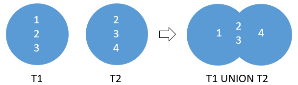
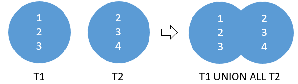
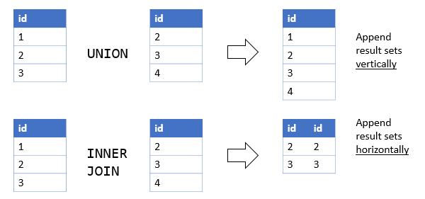

# 1. UNION
## syntax
```oracle-sql
SELECT
    column_list_1
FROM
    T1
UNION 
SELECT
    column_list_2
FROM
    T2;
```

- T1, T2 를 합칠 때 중복되는 행 2,3 을 제거한다.
- column_list_1 과 column_list_2 에는 동일한 순서로 동일한 수의 열이 표시되어야 한다.
- 또한 해당 컬럼의 데이터 타입은 숫자나 문자와 같이 동일한 데이터 타입 그룹에 속해야 한다.
- union 은 두 결과 집합에서 unique row 를 반환한다. 중복행 유지는 union all 을 사용한다.

```oracle-sql
SELECT
    column_list
FROM
    T1
UNION ALL 
SELECT
    column_list
FROM
    T2;
```

- T1, T2 를 합칠 때 중복되는 행 2,3 을 유지한다.


## practice


### A) Oracle UNION example
```oracle-sql
SELECT
    first_name,
    last_name,
    email,
    'contact'
FROM
    contacts
UNION SELECT
    first_name,
    last_name,
    email,
    'employee'
FROM
    employees;
```
- employees 와 contacts 테이블 모두에서 이메일 주소로 이메일을 보내야 한다고 가정해 보자
- select 에서 'contact' 와 'employee' 는 테이블에 없는  column 이다. 이런 경우  'contact' 라는 컬럼으로 'contact' 값을 전부 가지게 된댜(employee 도 마찬가지)
- select 에서의 column list 가 서로 다르다.(contact, employee)
- 첫번째 select column list 인 contact 로 컬럼 명이 선택되고 그 안에 value 값으로 contact 와 employee 를 가지게 된다
- column list 의 컬럼 수는 4개, 데이터 타입 모두 동일해야 union 이 된다.
- 

### B) Oracle UNION and ORDER BY example
```oracle-sql
SELECT
    first_name || ' ' || last_name name,
    email,
    'contact'
FROM
    contacts
UNION SELECT
    first_name || ' ' || last_name name,
    email,
    'employee'
FROM
    employees
ORDER BY
    name DESC;
```
- 2개 union 후 정렬한다.

### C) Oracle UNION ALL example
```oracle-sql
SELECT
    last_name
FROM
    employees
UNION SELECT
    last_name
FROM
    contacts
ORDER BY
    last_name;
```
- employees 와 contacts 에서 unique last names 을 추출한다.(357 rows)

```oracle-sql
SELECT
    last_name
FROM
    employees
UNION ALL SELECT
    last_name
FROM
    contacts
ORDER BY
    last_name;
```
- union all 를 사용하면 unique 가 아닌 중복 된 것은 유지시킨다.(426 rows)

## Oracle UNION vs. JOIN


- union 은 vertically 하게 데이터를 합친다.
- inner join 혹은 left join 은 horizontally 하게 데이터를 합친다.