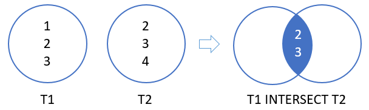

# 2. INTERSECT
## syntax
```SELECT
    column_list_1
FROM
    T1
INTERSECT 
SELECT
    column_list_2
FROM
    T2;
```

- 다음 규칙을 따른다.
  - 두 쿼리의 column 수와 순서가 동일해야 한다.
  - 해당 column 의 데이터 타입은 숫자 또는 문자와 같이 동일해야 한다.

  
## practice


```oracle-sql
SELECT
    last_name
FROM
    contacts
INTERSECT 
SELECT
    last_name
FROM
    employees
ORDER BY
    last_name;
```
- 공통적으로 사용되는 last_name 을 출력한다


