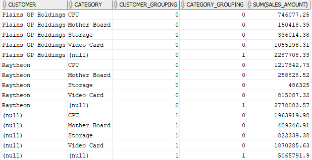

# 1. Grouping sets
- 쿼리에서 여러 그룹화된 집합을 생성하기 위해 `GROUPING SETS`를 활용하는 방법에 대해 알아보자
- 즉 여러개의 그룹화된 집합을 union all 대신 효과적으로 사용하기 위해 grouping sets 를 활용한다

## preparing
```oracle-sql
CREATE VIEW customer_category_sales AS
SELECT 
    category_name category, 
    customers.name customer, 
    SUM(quantity*unit_price) sales_amount
FROM 
    orders
    INNER JOIN customers USING(customer_id)
    INNER JOIN order_items USING (order_id)
    INNER JOIN products USING (product_id)
    INNER JOIN product_categories USING (category_id)
WHERE 
    customer_id IN (1,2)
GROUP BY 
    category_name, 
    customers.name;
```
- test 를 위해 view 를 1개 생성한다.
- 상품 카테코리 별, 고객별 판매 금액을 반환한다.
- 데모 목적으로 id 1, id 2인 고객 2명만 선택한다.

```oracle-sql
SELECT 
    customer, 
    category, 
    sales_amount 
FROM 
    customer_category_sales
ORDER BY
    customer,
    category;
```
- customer_category_sales 에서 데이터를 반환한다.

```oracle-sql
(column1, column2,...)
```
- group by 절을 이용하여 gruop 으로 사용할 1개 혹은 그 이상의 column 들의 group set 을 만든다.
- group set 은 , 로 구분되어 리스트를 만든다.

```oracle-sql
SELECT 
    category, 
    SUM(sales_amount) 
FROM 
    customer_category_sales
GROUP BY 
    category;
```
- 위 쿼리는 category 컬럼을 포함하는 grouping set 을 반환한다. (category)

```oracle-sql
SELECT 
    customer, 
    category, 
    sales_amount 
FROM 
    customer_category_sales
ORDER BY
    customer,
    category;
```
- customer 과 category 두개의 컬럼을 grouping set 에 포함하여 반환한다. (customer, category)

```oracle-sql
SELECT 
    SUM(sales_amount)
FROM 
    customer_category_sales;
```
- grouping set 에 컬럼을 포함하지 않을 수 있다. 이런 경우 grouping set 은 비어있게 되고, () 이다.
- 지금까지 4개의 grouping sets 를 반환하는 4개의 쿼리를 확인하였다
  - grouping sets : (category), (customer), (category, customer), ()
- 하지만 union all 은 관련된 모든 쿼리가 동일한 수의 column 을 반환하는 것을 요구한다. 
- 따라서 union all 을 작동시키기 위해서는 null 을 각 쿼리의 선택 목록으로 추가해야 한다.

```oracle-sql
SELECT 
    category, 
    NULL,
    SUM(sales_amount) 
FROM 
    customer_category_sales
GROUP BY 
    category
UNION ALL    
SELECT 
    customer,
    NULL,
    SUM(sales_amount)
FROM 
    customer_category_sales
GROUP BY 
    customer
UNION ALL
SELECT 
    customer, 
    category, 
    sum(sales_amount)
FROM 
    customer_category_sales
GROUP BY 
    customer,
    category
UNION ALL   
SELECT
    NULL,
    NULL,
    SUM(sales_amount)
FROM 
    customer_category_sales;
```
- 위 커리의 문제는 2가지이다
    - 1. 너무 길어서 읽고 유지하기가 어렵다
    - 2. Oracle 이 먼저 4개의 쿼리를 개별적으로 실행한 다음 모든 결과집합을 하나로 결합해야 하기 때문에 최적의 성능이 나오지 않는다.
- 이러한 문제를 해결하기 위해 grouping sets 이라는 표현을 도입하였다.

## syntax
### Oracle GROUPING SETS expression
```oracle-sql
GROUP BY
    GROUPING SETS(grouping_set_list);
```
- grouping sets 를 활용하여 하나 이상의 그룹화 집합을 정의할 수 있다.
```oracle-sql
GROUP BY
    GROUPING SETS(
        (), 
        (c1), 
        (c2), 
        (c1,c2), 
        (c1,c2,c3)
    )
```
- 쉼표를 통해 그룹화 집합의 목록을 만들 수 있다.
- 위 쿼리에는 총 5개의 집합이 존재한다.

## practice
- union all 대신에 grouping sets 를 활용하여 위에서 언급한 쿼리를 개선시킬 수 있다.
```oracle-sql
SELECT 
    customer, 
    category,
    SUM(sales_amount)
FROM 
    customer_category_sales
GROUP BY 
    GROUPING SETS(
        (customer,category),
        (customer),
        (category),
        ()
    )
ORDER BY 
    customer, 
    category;   
```
- (customer,category) 는 customer category 별로 분류하여 제공해준다.


- (customer) 는 customer 로만 분류되기 때문에 category 는 모든 값 집합을 의미하기 때문에 null 로 처리한다

### Oracle GROUPING() function
- `GROUPING()` 기능을 super-aggregate rows from regular grouped rows 와는 다르다.

```oracle-sql
GROUPING(expression)
```
- 이 때 expression 은 `group by`절의 expression 과 반드시 매치되어야 한다.
- `GROUPING()` 함수는 행의 표현식 값이 모든 값 집합을 나타내는 NULL인 경우 값 1을 반환합니다. 그렇지 않으면 0을 반환합니다.
```oracle-sql
SELECT 
    customer, 
    category,
    GROUPING(customer) customer_grouping,
    GROUPING(category) category_grouping,
    SUM(sales_amount) 
FROM customer_category_sales
GROUP BY 
    GROUPING SETS(
        (customer,category),
        (customer),
        (category),
        ()
    )
ORDER BY 
    customer, 
    category;
```


- 5 rows 는 (customer) 로 그룹화가 되었기 때문에 category_grouping 이 1인것을 확인할 수 있다. - category 전부 해당
- 마지막 5개의 rows 는 (category) 로 그룹화 되었기 때문에 customer_grouping 이 1이다 - customer 전부 해당

```oracle-sql
SELECT 
    DECODE(GROUPING(customer),1,'ALL customers', customer) customer,
    DECODE(GROUPING(category),1,'ALL categories', category) category,
    SUM(sales_amount) 
FROM 
    customer_category_sales
GROUP BY 
    GROUPING SETS(
        (customer,category),
        (customer),
        (CATEGORY),
        ()
    )
ORDER BY 
    customer, 
    category;
```
- decode 를 이용하여 출력을 더 이쁘게 만들 수 있다.


### Oracle GROUPING_ID() function
- `GROUPING_ID()` 는 group by columns 에서 group by 의 leverl 에 해당하는 값을 할당한다.
- 즉 subtotal rows 를 확인할 수 있는 또다른 간결한 방식을 제공한다.

```oracle-sql
SELECT 
    customer, 
    category,
    GROUPING_ID(customer,category) grouping,
    SUM(sales_amount) 
FROM customer_category_sales
GROUP BY 
    GROUPING SETS(
        (customer,category),
        (customer),
        (category),
        ()
    )
ORDER BY 
    customer, 
    category;
```


- 0 : (customer, category)
- 1 : (customer)
- 2 : (category)
- 3 : ()  - `SELECT SUM(sales_amount) FROM customer_category_sales;`
