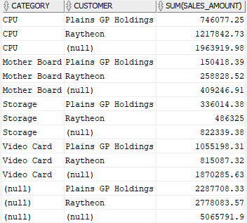
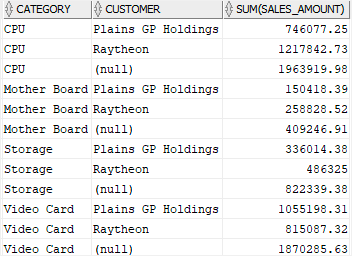

# 2. CUBE
## syntax
- `CUBE` 는 `GROUP BY` 의 확장버전이다
- `CUBE` 는 all possible combinations of dimensions 의 grouping sets 를 만들 수 있게 해준다.

```oracle-sql
SELECT c1, c2, c3, aggregate(c4)
FROM table_name
GROUP BY CUBE(c1,c2,c3);
```
- 위 커리에서 c1, c2, c3 컬럼을 dimensions 라고 부른다
- aggregate(c4)의 결과는 fact 라고 한다.
- 보통 fact 는 sales amount 와 같은 숫자이다.
- dimensions 는 fact 에게 business context 를 제공한다.
- 예를 들어, 상품 category 및 customer 컬럼은 상품 category 별 총 sales amount, 고객별 총 sales amount 등 판매 금액을 설명하는 dimensions 이다.
- `CUBE` 는 c1, c2, c3 dimensions 로 조합할수 있는 모든 grouping sets 를 만든다. 총 개수는 8개이다(2^3)
- 보통 n 개의 컬럼으로 `CUBE` 를 명시할 시 2^n 개의 grouping sets 를 만든다.
- SUM() 과 같은 aggregate function 를 사용하면 모든 가능 조합인 2^n 의 subtotals 를 얻게 된다.

## practice
```oracle-sql
CREATE OR REPLACE VIEW customer_category_sales AS
SELECT 
    category_name category, 
    customers.name customer, 
    SUM(quantity*unit_price) sales_amount
FROM 
    orders
    INNER JOIN customers USING(customer_id)
    INNER JOIN order_items USING (order_id)
    INNER JOIN products USING (product_id)
    INNER JOIN product_categories USING (category_id)
WHERE 
    customer_id IN (1,2)
GROUP BY 
    category_name, 
    customers.name;
```
- 기존의 customer_category_sales view 를 변경한다

```oracle-sql
SELECT
    category,
    customer,
    SUM(sales_amount) 
FROM 
    customer_category_sales
GROUP BY 
    CUBE(category,customer)
ORDER BY 
    category NULLS LAST, 
    customer NULLS LAST;
```
- 위 쿼리는 `CUBE`를 활용하면서 2개의 dimension (category, customer) 를 사용하였다
- 따라서 총 4개의 subtotals 를 얻게 된다.
  - A subtotal by category. 
  - A subtotal by customer. 
  - A subtotal by both category and customer. 
  - A grand total.


```oracle-sql
SELECT c1, c2, c3, aggregate(c4)
FROM table_name
GROUP BY c1, CUBE(c2,c3);
```
- 위 쿼리와 같이 partial cube 를 사용하여 grouping sets 의 수를 줄일 수 있다.
- 8개(2^3)의 grouping sets 대신 4개(2^2)를 얻게 된다.

```oracle-sql
SELECT
    category,
    customer,
    SUM(sales_amount) 
FROM 
    customer_category_sales
GROUP BY 
    category,
    CUBE(customer)
ORDER BY 
    category, 
    customer NULLS LAST; 
```
- 위 쿼리는 category dimension 만 사용하여 subtotals 를 만들기 위해 partial cube 를 활용하였다.
