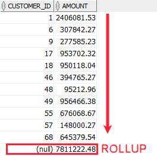
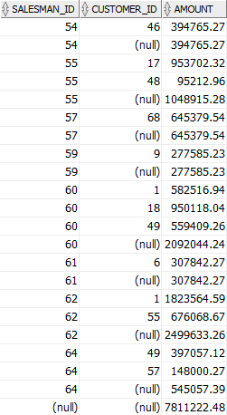

# 3. ROLLUP
## practice


```oracle-sql
SELECT
   customer_id,
   SUM(quantity * unit_price) amount
FROM
   orders
INNER JOIN order_items USING (order_id)
WHERE
   status      = 'Shipped' AND 
   salesman_id IS NOT NULL AND 
   EXTRACT(YEAR FROM order_date) = 2017
GROUP BY
   customer_id
ORDER BY
   amount DESC;
```
- 위 쿼리는 2017년 customer 별 sales revenue 를 반환한다.
- Shipped 상태의 sales orders 의 순 이익을 계산하고 판매원을 담당한다.


amount 열에 있는 값의 합계를 얻으려면 다음 하위 쿼리를 사용할 수 있다.
```oracle-sql
SELECT
   SUM(amount)
FROM
   (
      SELECT
         customer_id,
         SUM(quantity * unit_price) amount
      FROM
         orders
      INNER JOIN order_items USING (order_id)
      WHERE
         status      = 'Shipped' AND 
         salesman_id IS NOT NULL AND 
         EXTRACT(YEAR FROM order_date) = 2017
      GROUP BY
         customer_id
   );
```

Oracle 은 위 방식보다 더 낫고 빠른 방식을 제공하며 ROLLUP을 활용하면 된다.
```oracle-sql
SELECT
   customer_id,
   SUM(quantity * unit_price) amount
FROM
   orders
INNER JOIN order_items USING (order_id)
WHERE
   status      = 'Shipped' AND 
   salesman_id IS NOT NULL AND 
   EXTRACT(YEAR FROM order_date) = 2017
GROUP BY
   ROLLUP(customer_id);
```
- 위 쿼리의 group by 에서 rollup을 활용하면 맨마지막에 총 만매금액을 계산해 준다


## syntax
```oracle-sql
SELECT
   col1,
   col2,
   aggregate(col3)
FROM
   table_name
GROUP BY
   ROLLUP (col1, col2);
```
- rollup의 작동순서는 다음과 같다
- 1. group by 절에 있는 standard aggregate 를 계산한다
- 2. 오른쪽에서 왼쪽으로 grouping columns(col1, col2) 의 higher-level subtotals 를 공격적으로 만든다 - 아래 1,2,3 예시 참조
- 3. grand total 를 계산한다.
- rollup 은 rollup 에 명시된 컬럼들을 그룹핑하는 숫자 + grand total 수만큼의 그룸핑 셋 을 만든다
- 만약 n 개의 컬럼이 rollup 안에 있으면, n+1 만큼의 subtotal 을 얻게 된다.
- 위의 쿼리예시에서 는 다음과 같은 grouping sets 을 얻는다
1. (col1, col2)
2. (col2)
3. grand total
- subtotal의 수를 줄이기 위헤, partial roll up 을 수행하기도 한다

```oracle-sql
SELECT
   col1,
   col2,
   aggregate(col3)
FROM
   table_name
GROUP BY
   col1,
   ROLLUP (col2);
```

### More  Oracle ROLLUP examples
```oracle-sql

SELECT
   salesman_id,
   customer_id,
   SUM(quantity * unit_price) amount
FROM
   orders
INNER JOIN order_items USING (order_id)
WHERE
   status      = 'Shipped' AND 
   salesman_id IS NOT NULL AND 
   EXTRACT(YEAR FROM order_date) = 2017
GROUP BY
   ROLLUP(salesman_id,customer_id);
```
- salesman 및 customer 별로 sales values 를 반환한다.




