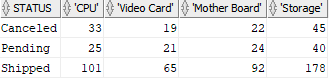

# 4. PIVOT
## syntax
- Oracle11g 부터 도입되었다.
- 행을 열로 바꾸는 교차 테이블 쿼리를 작성할 수 있게 한다.
- pivot 활용시 시작 데이터 세트보다 더 많은 열과 더 적은 행을 반환한다.


```oracle-sql
SELECT 
    select_list
FROM 
    table_name
PIVOT [XML] ( 
    pivot_clause
    pivot_for_clause
    pivot_in_clause 
);
```
- pivot_clause: 집계하려는 열을 지정한다. 
  - pivot_clause 는 pivot_in_clause에서 제공하는 값과 함께 pivot_clause 절에 지정되지 않은 모든 열을 기반으로 암묵적으로 GROUP BY 를 수행한다.
- pivot_for_clause: group 하거나 pivot 할 열을 지정한다
- pivot_in_clause: pivot_for_clause 에 열들에 대한 필터를 정의한다.
  - pivot_in_clause 의 각 값들에 대한 집계는 분리된 열로 rotate 된다


## practice
### Oracle PIVOT example
```oracle-sql
CREATE VIEW order_stats AS
SELECT 
    category_name, 
    status, 
    order_id
FROM 
    order_items
INNER JOIN orders USING (order_id)
INNER JOIN products USING (product_id)
INNER JOIN product_categories USING (category_id);
```
- pivot 테스트를 위해 product category, order status, order id 가 포함된 order_stats 라는 view 를 만든다

```oracle-sql
SELECT * FROM order_stats
PIVOT(
    COUNT(order_id) 
    FOR category_name
    IN ( 
        'CPU',
        'Video Card',
        'Mother Board',
        'Storage'
    )
)
ORDER BY status;
```
- pivot 을 사용하여 order status 별로 number of orders for each product 를 반환한다
  - pivot_clause: COUNT(order_id)
  - pivot_for_clause: FOR category_name
  - pivot_in_clause:
```oracle-sql
IN (
    'CPU',
    'Video Card',
    'Mother Board',
    'Storage'
)
```
- COUNT()함수는 범주 및 주문 상태별로 주문 수를 반환한다
- pivot_in_clause 쿼리는 결과 집합의 열 머리글에 대해 지정된 값을 사용한다



### Aliasing pivot columns
- pivot_clause 에서 1개 혹은 더 많은 열들에 별칭을 지정할 수 있다.
- pivot_in_clause 에 있는 값들에도 마찬가지이다.
- 오라클을 별칭에 있어 다음과 같은 convention 을 사용한다.


```oracle-sql
SELECT * FROM order_stats
PIVOT(
    COUNT(order_id) order_count
    FOR category_name
    IN ( 
        'CPU' CPU,
        'Video Card' VideoCard, 
        'Mother Board' MotherBoard,
        'Storage' Storage
    )
)
ORDER BY status;
```
- 별칭 예시이다


- **만약 pivot_clause 에서 1개 이상의 집계 함수를 사용한다면, 집계 함수중 적어도 1개에는 별칭을 반드시 제공해야 한다.**

### Pivoting multiple columns
- 이전 예시에서는 pivot_clause 에서 1개의 집계 함수를 사용하였는데 이번에는 2개의 집계 함수를 사용한다

```oracle-sql
CREATE OR REPLACE VIEW order_stats AS
SELECT 
    category_name, 
    status, 
    order_id, 
    SUM(quantity * list_price) AS order_value
FROM 
    order_items
INNER JOIN orders USING (order_id)
INNER JOIN products USING (product_id)
INNER JOIN product_categories USING (category_id)
GROUP BY 
    order_id, 
    status, 
    category_name;
```
- 시작하기 앞서 이전에 만든 order_status view 에서 order_stats 주문 값을 열을 포함하도록 변경한다.

```oracle-sql
SELECT * FROM order_stats
PIVOT(
    COUNT(order_id) orders,
    SUM(order_value) sales
    FOR category_name
    IN ( 
        'CPU' CPU,
        'Video Card' VideoCard, 
        'Mother Board' MotherBoard,
        'Storage' Storage
    )
)
ORDER BY status;
```
- orders 와 sales 로 인해 피벗 열의 수가 2배로 증가한다.


```oracle-sql
SELECT * FROM order_stats
PIVOT(
    COUNT(order_id) orders,
    SUM(order_value) sales
    FOR status
    IN ( 
        'Canceled' Canceled,
        'Pending' Pending, 
        'Shipped' Shipped
    )
)
ORDER BY category_name;   
```
- category_name 이 아닌 status 를 pivot_for_clause 로 사용하였다.


### Oracle PIVOT with subquery
- pivot_in_clause 에 subquery 를 사용할 수 없다.
```oracle-sql
SELECT * FROM order_stats
PIVOT(
    COUNT(order_id) orders,
    SUM(order_value) sales
    FOR category_name
    IN ( 
       SELECT category_name 
       FROM product_categories
    )
)
ORDER BY status;
```
- 실행시 ORA-00936: missing expression 에러가 발생한다.
- 이러한 제한은 XML 옵션을 통해 해결할 수 있다.
```oracle-sql
SELECT * FROM order_stats
PIVOT XML (
    COUNT(order_id) orders,
    SUM(order_value) sales
    FOR category_name
    IN ( 
       SELECT category_name 
       FROM product_categories
    )
)
ORDER BY status;    
```

```xml
<PivotSet>
    <item>
        <column name="CATEGORY_NAME">CPU</column>
        <column name="ORDERS">13</column>
        <column name="SALES">4122040.7</column>
    </item>
    <item>
        <column name="CATEGORY_NAME">Mother Board</column>
        <column name="ORDERS">12</column>
        <column name="SALES">679121.39</column>
    </item>
    <item>
        <column name="CATEGORY_NAME">RAM</column>
        <column name="ORDERS">0</column>
        <column name="SALES" />
    </item>
    <item>
        <column name="CATEGORY_NAME">Storage</column>
        <column name="ORDERS">14</column>
        <column name="SALES">3023747.6</column>
    </item>
    <item>
        <column name="CATEGORY_NAME">Video Card</column>
        <column name="ORDERS">9</column>
        <column name="SALES">1677597.4</column>
    </item>
</PivotSet>
```
- SQL Developer의 출력 표에서 XML을 보려면 다음 단계에 따라 설정해라
- 해당 옵션실행은 다음 사이트를 참조하라
[sql developer xml setting](https://www.oracletutorial.com/oracle-basics/oracle-pivot/)
