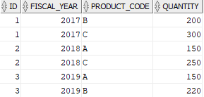
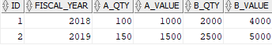

# 5. UNPIVOT
## syntax
- unpivot 를 사용하면 열과 행을 바꿀 수 잇다.
- 열과 행을 바꾸는 과정에서 데이터를 de-aggregate 하지 않는다는 점을 제외하면 unpivot 과 pivot 은 반대된다.


```oracle-sql
SELECT 
    select_list
FROM table_name
UNPIVOT [INCLUDE | EXCLUDE NULLS](
    unpivot_clause
    unpivot_for_clause
    unpivot_in_clause 
);
```
- unpivot_clause: 피벗되지 않은 측정값을 나타내는 열의 이름을 지정
- unpivot_for_clause:  측정 값을 보유할 각 열의 이름을 지정
- unpivot_in_clause: 피벗 해제될 피벗된 열이 포함
  - `NCLUDE | EXCLUDE NULLS` 절을 사용하면 null 값 행을 포함하거나 제외할 수 있다.
- INCLUDE NULLS: null 값 행을 포함하도록 지시
- EXCLUDE NULLS: 반환된 결과 집합에서 null 값 행을 제거

## practice
```oracle-sql
CREATE TABLE sale_stats(
    id INT PRIMARY KEY,
    fiscal_year INT,
    product_a INT,
    product_b INT,
    product_c INT
);
```
- 테스트를 위해 sale_stats 테이블을 새로 만든다.

```oracle-sql
INSERT INTO sale_stats(id, fiscal_year, product_a, product_b, product_c)
VALUES(1,2017, NULL, 200, 300);

INSERT INTO sale_stats(id, fiscal_year, product_a, product_b, product_c)
VALUES(2,2018, 150, NULL, 250);

INSERT INTO sale_stats(id, fiscal_year, product_a, product_b, product_c)
VALUES(3,2019, 150, 220, NULL);
```
- sale_stats 테이블에 임시 데이터를 집어넣는다.

```oracle-sql
SELECT * FROM sale_stats;
```


### Oracle UNPIVOT examples
```oracle-sql
SELECT * FROM sale_stats
UNPIVOT(
    quantity  -- unpivot_clause
    FOR product_code --  unpivot_for_clause
    IN ( -- unpivot_in_clause
        product_a AS 'A', 
        product_b AS 'B', 
        product_c AS 'C'
    )
);
```
- unpivot 절은 product_a, product_b, product_c 컬럼을 로우로 rotate 시킨다.
- unpivot_clause: quantity
  - product_a, product_b, product_c 에서 unpivot 할 값을 대표하는 컬럼이다.
- unpivot_for_clause: FOR product_code
  - 측정 값을 보유할 열이다
- unpivot_in_clause:
```oracle-sql
    IN ( -- unpivot_in_clause
        product_a AS 'A', 
        product_b AS 'B', 
        product_c AS 'C'
    )
```
- product_a, product_b, product_c 컬럼에서 unpivot 할 값들을 오라클에 지시한다.
- 최종 결과물은 다음과 같다



- unpivot 은 기본적으로 null 값 행을 제외하므로 null 이 출력에 표시되지 않는다.
- 아래와 같은 쿼리를 통해 null 을 포함시킬 수 있다.

```oracle-sql
SELECT * FROM sale_stats
UNPIVOT INCLUDE NULLS(
    quantity
    FOR product_code 
    IN (
        product_a AS 'A', 
        product_b AS 'B', 
        product_c AS 'C'
    )
);
```


### Oracle unpivot multiple columns
- multiple columns 를 unpivot 하는 것을 확인해 보자

```oracle-sql
DROP TABLE sale_stats;
    
CREATE TABLE sale_stats(
    id INT PRIMARY KEY,
    fiscal_year INT,
    a_qty INT,
    a_value DEC(19,2),
    b_qty INT,
    b_value DEC(19,2)
);   

INSERT INTO sale_stats(id, fiscal_year, a_qty, a_value, b_qty, b_value)
VALUES(1, 2018, 100, 1000, 2000, 4000);

INSERT INTO sale_stats(id, fiscal_year, a_qty, a_value, b_qty, b_value)
VALUES(2, 2019, 150, 1500, 2500, 5000);

SELECT * FROM sale_stats;
```
- 테이블을 drop 하고 sale_stats 테이블을 다시만든다.



```oracle-sql
SELECT * FROM sale_stats
UNPIVOT (
    (quantity, amount)
    FOR product_code
    IN (
        (a_qty, a_value) AS 'A', 
        (b_qty, b_value) AS 'B'        
    )
);
```
- unpivot 을 사용하여 a_qty, a_value, b_qty, b_value 컬럼들을 행으로 transpose 시킨다.
- 결과는 다음과 같은 방식으로 출력된다.


