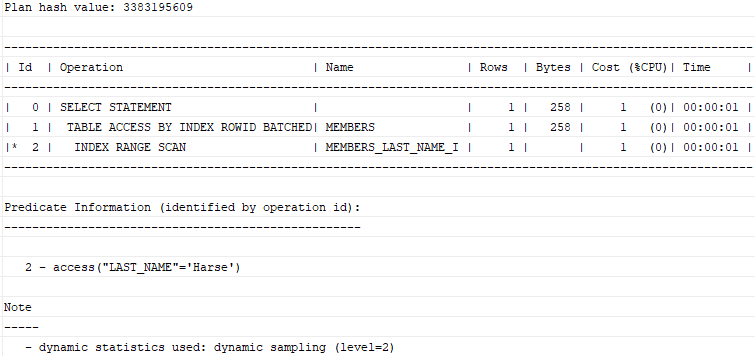
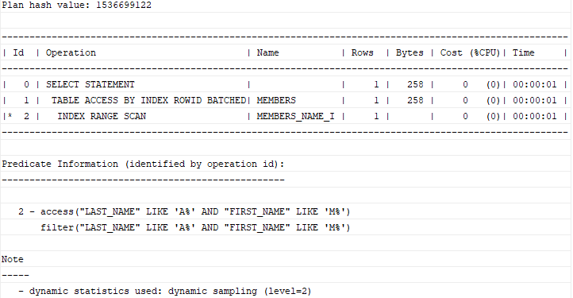

# 1. Create a new index
## syntax
```oracle-sql
CREATE INDEX index_name
ON table_name(column1[,column2,...])
```
- index 의 이름을 지정할 떄는 보통 의미있으면서 규칙을 지켜서 설정해야 한다.
- table_name 과 column_name 을 함께 쓰고 접미사로 I 혹은 i 를 붙여 index 임을 명시한다.
  - <table_name>_<column_name>_I
  - <table_name>_<column_name>_i
- CREATE INDEX 구문은 기본적으로 btree index 로 형성된다.
- primary 를 가지는 table 을 새로 만들때, 오라클은 자동으로 primary key 컬럼에 대한 index 를 새로 만든다.
- 다른 DB system 과 다르게 오라클은 foreign key 컬럼에 대한 index 는 자동으로 만들지 않는다.

## practice
### Oracle CREATE INDEX examples
```oracle-sql
CREATE TABLE members(
    member_id INT GENERATED BY DEFAULT AS IDENTITY,
    first_name VARCHAR2(100) NOT NULL,
    last_name VARCHAR2(100) NOT NULL,
    gender CHAR(1) NOT NULL,
    dob DATE NOT NULL,
    email VARCHAR2(255) NOT NULL,
    PRIMARY KEY(member_id)
);
```
- 실습하기 전에 members 테이블을 만든다.
- 그 후 아래 링크를 눌러 데이터를 집어 넣자<br>
[members data](https://www.oracletutorial.com/wp-content/uploads/2019/01/load_member_data.txt)<br>

- members 는 member_id 를 primary key 로 가지기 때문에 오라클은 자동으로 해당 컬럼에 인덱스를 만든다.
- table 의 모든 index 를 확인하기 위해서 다음 쿼리를 실행해보자
```oracle-sql
SELECT 
    index_name, 
    index_type, 
    visibility, 
    status 
FROM 
    all_indexes
WHERE 
    table_name = 'MEMBERS';
```
### Creating an index on one column example
- last name 으로 members 를 조회할 때 쿼리가 느리다고 가정해 보자
- 조회 속도를 늘리기 위해 last_name 으로 index 를 만들어 보자
```oracle-sql
CREATE INDEX members_last_name_i 
ON members(last_name);
```
- member 에 만들어진 index 를 조회 해 보자
```oracle-sql
SELECT 
    index_name, 
    index_type, 
    visibility, 
    status 
FROM 
    all_indexes
WHERE 
    table_name = 'MEMBERS';
```
- index 가 2개로 늘어난 것을 확인 할 수 있다.

```oracle-sql
EXPLAIN PLAN FOR
SELECT * FROM members
WHERE last_name = 'Harse';
```
- 실제 last_name 을 조건절로 조회시 어떤 실행계획을 타는지(index 를 활용하는지) 확인하기 위해 EXPLAIN PLAN 을 사용해 보자
- 해당 구문을 통해 SQL 문을 분석, 해석하여 실행계획을 수립한 뒤 plan_table 에 저장하게 된다.
  - SQL 문이 어떻게 실행되고 작동하는지 점검하기 위한 기능
- DBMS_XPLAN.DISPLAY() 프로시저를 사용하여 plan_table 에 있는 content 를 볼 수 있다.
```oracle-sql
SELECT 
    PLAN_TABLE_OUTPUT 
FROM 
    TABLE(DBMS_XPLAN.DISPLAY());
```
- 해당 구문을 사용하면 다음과 같은 결과를 얻게 된다.



### Removing an index
```oracle-sql
DROP INDEX index_name;
```
- DROP INDEX 를 통해 index 를 제거할 수 있다.

```oracle-sql
DROP INDEX members_last_name_i;
```
- 예시

### Creating an index on multiple columns example
```oracle-sql
CREATE INDEX members_name_i
ON members(last_name,first_name);
```
- members 에 last_name 과 first_name 두개에 index 를 만드는 예시이다.

```oracle-sql
SELECT * 
FROM members
WHERE last_name LIKE 'A%' 
    AND first_name LIKE 'M%';
```
- last name 이 A 로 시작하고 first name 이 M 으로 시작하는 멤버를 찾는 쿼리이다.

```oracle-sql
EXPLAIN PLAN FOR
SELECT * 
FROM members
WHERE last_name LIKE 'A%' 
    AND first_name LIKE 'M%';
    
    
SELECT 
    PLAN_TABLE_OUTPUT 
FROM 
    TABLE(DBMS_XPLAN.DISPLAY());
```
- 어떤 실행계획으로 해당 구문이 실행되었는지 확인해 보자



