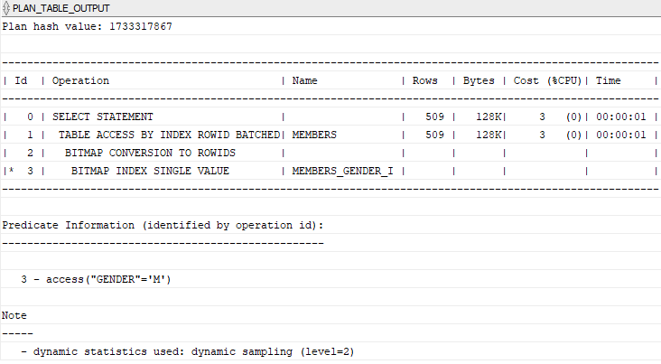

# 5. Bitmap index
## syntax
```oracle-sql
CREATE BITMAP INDEX index_name
ON table_name(column1[,column2,...]);
```

## practice
- 실습을 위해 기존에 만든 members 테이블을 활용한다.
```oracle-sql
 SELECT 
    *
FROM
    members
WHERE
    gender = 'F';
```
- 다음 쿼리는 모든 여성 구성원을 찾는다.
- gender 열에는 여성은 F, 남성은 오직 2가지의 고유한 값만 있다.
- 열에 고유한 값이 적은 경우 해당 열의 카디널리티가 낮다고 본다.
- 오라클은 이러한 유형의 열에 대해 bitmap index 라는 특별한 종류의 인덱스를 가지고 있다.
- bitmap index 는 bitmap 또는 bit array 를 사용하는 특별한 종류의 DB index 이다.
- bitmap index 에서 오라클은 각 index key 에 대한 bitmap  을 저장한다.
- 각 index key 는  multiple rows 를 향한 pointers 를 저장한다.


- 다음은 gender 컬럼에 대한 bitmap index 를 만드는 예시이다.
- 각 gender 에 대해 1개씩 2개의 분리된 bitmaps 를 가지고 있다.
- 오라클은 mapping function 을 사용하여 bitmap 에 있는 각각의 bit 를 members 테이블에 상응하는 rowid 로 전환한다.

```oracle-sql
CREATE BITMAP INDEX index_name
ON table_name(column1[,column2,...]);
```
- syntax 는 다음과 같다.

```oracle-sql
CREATE BITMAP INDEX members_gender_i
ON members(gender);
```
- gender 컬럼에 대해 bitmap index 를 만들었다.

```oracle-sql
EXPLAIN PLAN FOR 
SELECT 
    *
FROM
    members
WHERE
    gender = 'F';

    
SELECT 
    PLAN_TABLE_OUTPUT 
FROM 
    TABLE(DBMS_XPLAN.DISPLAY());     
```
- 실행계획을 확인해 보자



### When to use Oracle bitmap indexes
#### Low cardinality columns
- 낮은 카디널리티를 가지는 열에 대해 bitmap index 를 활용한다.
- 열의 cardinality 를 찾기 위해 다음 쿼리를 활용한다.
```oracle-sql
SELECT column, COUNT(*)
FROM table_name
GROUP BY column;
```
- 고유한 값이 100개 미만인 열이 bitmap index 를 활용하기에 좋다.

#### Infrequently updated or read-only tables
- 비트맵 인덱스를 유지 관리하려면 많은 리소스가 필요하므로 비트맵 인덱스는 읽기 전용 테이블이나 업데이트 빈도가 낮은 테이블에만 적합하다. 
  - 따라서 데이터 웨어하우스 환경에서 비트맵 인덱스가 광범위하게 사용되는 경우가 많다.

- 많은 단일 행 업데이트, 특히 동시 단일 행 업데이트가 있는 테이블에 대해 비트맵 인덱스를 사용하면 교착 상태가 발생한다.
```oracle-sql
CREATE TABLE bitmap_index_demo(
    id INT GENERATED BY DEFAULT AS IDENTITY,
    active NUMBER NOT NULL,
    PRIMARY KEY(id)
);
```
- bitmap_index_demo 라는 테이블을 만든다.
```oracle-sql
CREATE BITMAP INDEX bitmap_index_demo_active_i
ON bitmap_index_demo(active);

```
- active 열에 비트맵 인덱스를 만든다.

```oracle-sql
INSERT INTO bitmap_index_demo(active) 
VALUES(1);

INSERT INTO bitmap_index_demo(active) 
VALUES(0);
```
- 2개의 세션을 열고 위 문중 하나를 반복적으로 실행한다.
- 그런 경우 ORA-00060: deadlock detected while waiting for resource 오류가 발생한다.