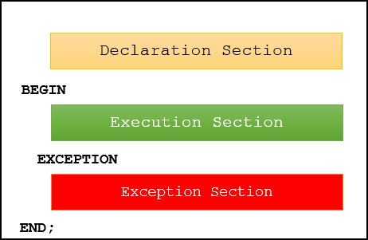
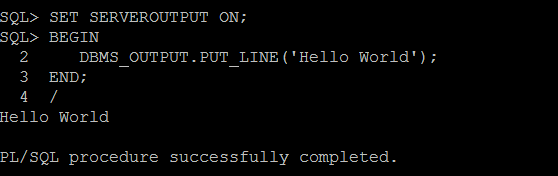

# 2. PL/SQL Anonymous Block
## PL/SQL anonymous block overview
- PL SQL 은 코드가 블록으로 구성된 block-structured language 이다.
- PL/SQL block 은 3개의 sections 으로 구성되어 있다.
  - declaration(선언)
  - executable(실행)
  - exception-handling(예외처리)
- executable 은 필수이며, declaration 과 exception-handling 은 선택 사항이다.
- PL/SQL 블록에는 이름이 있다.
  - Functions, Procedures 가 named block 의 예시이다.
  - named block 은 오라클 DB 서버에 저장되고 후에 재사용 가능하다
- 이름이 없는 block 은 anonymous block 이라고 한다.
  - anonymous block 은 오라클 DB  서버에 저장되지 않아 1번만 사용가능하다
  - 테스트 목적으로 유용하다.


 
- PL/SQL 블록의 구조이다.
1) Declaration section(선언부)
- PL/SQL 블록에는 변수를 선언하고 , cursors 에 대한 메모리를 할당하고 , data types  를 정의하는 선언 섹션이 있다.

2) Executable section(실행 가능한 부분)
- PL/SQL 블록에는 실행 섹션이 있습니다. 실행 섹션은 BEGIN 키워드로 시작하여 END 키워드로 끝난다. 실행 섹션에는 아무 작업도 수행하지 않는 명령문이더라도 최소한 하나의 실행 명령문이 있어야 한다. (예 - null statement)

3) Exception-handling section(예외 처리 섹션)
- PL/SQL 블록에는 EXCEPTION 키워드로 시작하는 예외 처리 섹션이 있다. 예외 처리 섹션은 실행 섹션의 코드에서 발생한 예외를 포착하고 처리하는 곳이다.

블록 자체는 실행 가능한 문이므로 다른 블록 내에 블록을 중첩할 수 있다.

## PL/SQL anonymous block example
```oracle-sql
BEGIN
   DBMS_OUTPUT.put_line ('Hello World!');
END;
```
- 화면에 'Hello World' 를 호출하는 DBMS_OUTPUT.put_line 프로시저를 호출한다.

## Execute a PL/SQL anonymous block using SQL*Plus


- 1. 오라클 db 서버 연결
- 2. SET SERVEROUTPUT ON 을 통해 server output 을 turn on 한다
- 3. 블록 실행
- 4. 마지막에 슬래시(/) 를 이벽하여 블록을 실행하도록 SQL*PLUS 에 지시

## 그 외 추가적인 것들 - 블록 재사용, tools 활용
[링크 참조](https://www.oracletutorial.com/plsql-tutorial/plsql-anonymous-block/)

