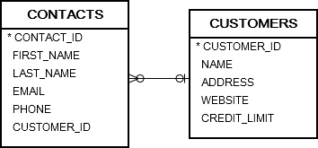

# 1. SELECT INTO
## syntax
```oracle-sql
SELECT
  select_list
INTO
  variable_list
FROM
  table_name
WHERE
  condition; 
```
- select into 는 테이블에서 변수로 단일 행을 가져오는 가장 간단하고 빠른 방법이다
- variable_list 에 컬럼 개수는 반드시 select_list 의 변수 개수(components of record 의 개수) 와 동일해야 한다
- 추가로 데이터 타입 또한 반드시 compatible 해야 한다.
- where 절이 아니어도 inner join, group by, having, union  같은 다른 select 를 사용할 수있다
- 만약 select 문이 1개 이상의 row 를 반환한다면, 오라클은 TOO_MANY_ROWS 예외를 발생시킨다.
- 만약 select 문이 아무 row 도 반환하지 않으면, 오라클은 NO_DATA_FOUND 예외를 발생시킨다.


## example


### A) PL/SQL  SELECT INTO – selecting one column example
```oracle-sql
DECLARE
  l_customer_name customers.name%TYPE;
BEGIN
  -- get name of the customer 100 and assign it to l_customer_name
  SELECT name INTO l_customer_name
  FROM customers
  WHERE customer_id = 100;
  -- show the customer name
  dbms_output.put_line( l_customer_name );
END;
```
- l_customer_name 변수를 선언한다
- customers 에서 customer_id 를 통해 row 를 가져오고 그중 name 값을 가져온다
- 그 후 그 값을 선언한 l_customer_name 변수에 할당한다.

### B) PL/SQL SELECT INTO – selecting a complete row example
```oracle-sql
DECLARE
  r_customer customers%ROWTYPE;
BEGIN
  -- get the information of the customer 100
  SELECT * INTO r_customer
  FROM customers
  WHERE customer_id = 100;
  -- show the customer info
  dbms_output.put_line( r_customer.name || ', website: ' || r_customer.website );
END;
```
- select * 로 row 를 가져오고 해당 row 를 r_customer record 변수에 할당한다.

### C) PL/SQL SELECT INTO – selecting data into multiple variables example
```oracle-sql
DECLARE
  l_customer_name customers.name%TYPE;
  l_contact_first_name contacts.first_name%TYPE;
  l_contact_last_name contacts.last_name%TYPE;
BEGIN
  -- get customer and contact names
  SELECT
    name, 
    first_name, 
    last_name
  INTO
    l_customer_name, 
    l_contact_first_name, 
    l_contact_last_name
  FROM
    customers
  INNER JOIN contacts USING( customer_id )
  WHERE
    customer_id = 100;
  -- show the information  
  dbms_output.put_line( 
    l_customer_name || ', Contact Person: ' ||
    l_contact_first_name || ' ' || l_contact_last_name );
END;
```
- multiple 변수에 할당 또한 가능하다

### PL/SQL SELECT INTO common errors
- select 절의 변수 개수보다 into 절의 변수 개수가 많거나 적으면 오류를 발생시킨다
- 데이터 유형이 호환되지 않아도 오류를 발생시킨다.


