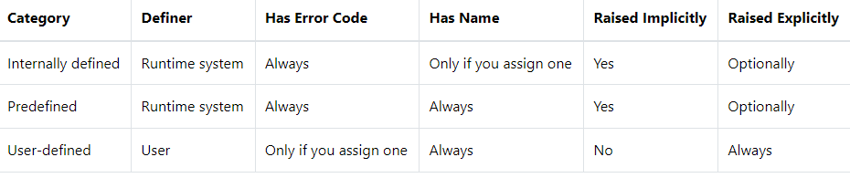

# 1. Exception
## syntax
```oracle-sql
BEGIN
    -- executable section
    ...
    -- exception-handling section
    EXCEPTION 
        WHEN e1 THEN 
            -- exception_handler1
        WHEN e2 THEN 
            -- exception_handler1
        WHEN OTHERS THEN
            -- other_exception_handler
END;
```
- 실행 섹션에서 예외가 발생하면 현재 블록의 실행이 준지되고 예외 처리 섹션으로 제어가 넘어간다.
- e1 에러 발생시 exception_handler1 실행
- e2 에러 발생시 exception_handler2 실행
- 다른 예외 발생 시 other_exception_handler 실행
- 예외 처리가 상핼된 후 제어는 바깥쪽 블록의 다음 명령문으로 이동한다.
- 둘러싸는 블록이 없는 경우 또한 예외 처리가 익명 블록에 있는 경우 또는 예외 처리가 하위 프로그램 또는 호스트 환경(SQL Developer, SQL*Plus) 에 있는 경우 제어가 호출자에게 반환된다.
- 예외가 발생했지만 예외 처리가 없으면 예외는 전파(Propagation) 된다.

## example
### PL/SQL NO_DATA_FOUND exception example
```oracle-sql
DECLARE
    l_name customers.NAME%TYPE;
    l_customer_id customers.customer_id%TYPE := &customer_id;
BEGIN
    -- get the customer name by id
    SELECT name INTO l_name
    FROM customers
    WHERE customer_id = l_customer_id;

    -- show the customer name   
    dbms_output.put_line('Customer name is ' || l_name);
    
END;
/
```
- customer id 로 0 을 적으면
- 오라클은 ORA-01403 오류를 발생시킨다.

```oracle-sql
DECLARE
    l_name customers.NAME%TYPE;
    l_customer_id customers.customer_id%TYPE := &customer_id;
BEGIN
    -- get the customer
    SELECT NAME INTO l_name
    FROM customers
    WHERE customer_id = l_customer_id;
    
    -- show the customer name   
    dbms_output.put_line('customer name is ' || l_name);

    EXCEPTION 
        WHEN NO_DATA_FOUND THEN
            dbms_output.put_line('Customer ' || l_customer_id ||  ' does not exist');
END;
/
```
- customer id 로 0 을 적으면
- Customer 0 does not exist 를 출력시킨다.

### PL/SQL TOO_MANY_ROWS exception example
```oracle-sql
DECLARE
    l_name customers.name%TYPE;
    l_customer_id customers.customer_id%TYPE := &customer_id;
BEGIN
    -- get the customer
    SELECT name INTO l_name
    FROM customers
    WHERE customer_id <= l_customer_id;
    
    -- show the customer name   
    dbms_output.put_line('Customer name is ' || l_name);

    EXCEPTION 
        WHEN NO_DATA_FOUND THEN
            dbms_output.put_line('Customer ' || l_customer_id ||  ' does not exist');
END;
/
```
- id 로 10 을 입력하면 ORA-01422 TOO_MANY_ROWS 에러를 발생시킨다.

```oracle-sql
DECLARE
    l_name customers.NAME%TYPE;
    l_customer_id customers.customer_id%TYPE := &customer_id;
BEGIN
    -- get the customer
    SELECT NAME INTO l_name
    FROM customers
    WHERE customer_id > l_customer_id;
    
    -- show the customer name   
    dbms_output.put_line('Customer name is ' || l_name);
    EXCEPTION 
        WHEN NO_DATA_FOUND THEN
            dbms_output.put_line('Customer ' || l_customer_id ||  ' does not exist');
        WHEN TOO_MANY_ROWS THEN
            dbms_output.put_line('The database returns more than one customer');    
END;
/
```
- 해당 예외를 처리해 주면 예외처리가 된다.

### PL/SQL exception categories
-- Internally defined exceptions 내부적으로 정의된 예외는 Oracle 데이터베이스 환경에서 발생하는 오류입니다. 런타임 시스템은 내부적으로 정의된 예외를 자동으로 발생시킵니다. ORA-27102(out of memory)는 내부적으로 정의된 예외의 한 예입니다. 내부적으로 정의된 예외에는 이름이 없고 오류 코드가 있습니다.
-- Predefined exceptions 미리 정의된 예외는 프로그램 실행 중에 발생하는 오류입니다. 미리 정의된 예외는 PL/SQL이 이름을 지정한 내부적으로 정의된 예외입니다(예: NO_DATA_FOUND, TOO_MANY_ROWS.
-- 사용자 정의 예외는 귀하와 같은 사용자가 정의한 사용자 지정 예외입니다. 사용자 정의 예외는 명시적으로 발생시켜야 합니다.
