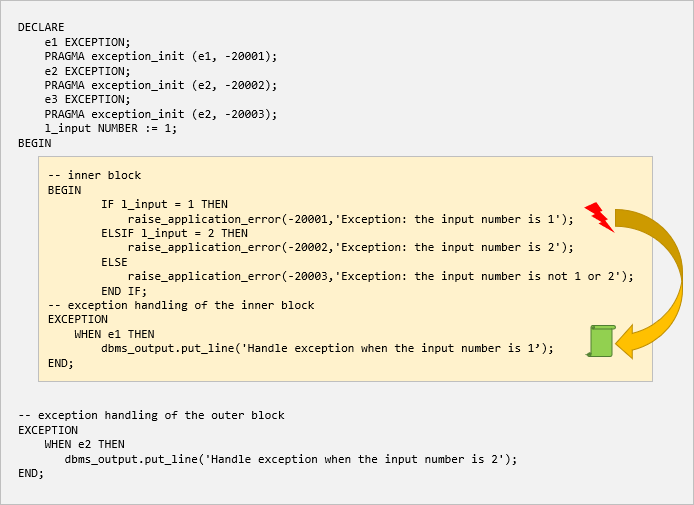
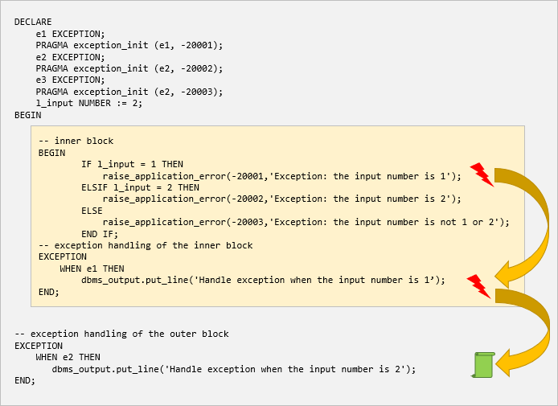
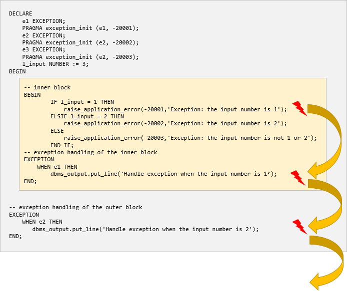

# 4. Exception propagation
## Introduction to the exception propagation
- 예외가 발생 하면 PL/SQL은 현재 블록(예: 익명 블록 , 프로시저 또는 예외 함수) 에서 예외 처리기를 찾습니다 . 
- 일치하는 항목이 없으면 PL/SQL은 예외를 현재 블록의 포함 블록으로 전파합니다.
- 그런 다음 PL/SQL은 둘러싸는 블록에서 예외를 한 번 더 발생시켜 예외 처리를 시도합니다. 
- 이 프로세스는 예외를 발생시킬 남아 있는 블록이 없을 때까지 각각의 연속적인 둘러싸는 블록에서 계속됩니다.
- 모든 블록에 예외 처리기가 없으면 PL/SQL은 가장 바깥쪽 PL/SQL 블록을 실행한 애플리케이션 환경에 처리되지 않은 예외를 반환합니다.
- 처리되지 않은 예외는 블록 실행을 중지합니다.

## Unhandled exception propagation examples
```oracle-sql
DECLARE
    e1 EXCEPTION;
    PRAGMA exception_init (e1, -20001);
    e2 EXCEPTION;
    PRAGMA exception_init (e2, -20002);
    e3 EXCEPTION;
    PRAGMA exception_init (e2, -20003);
    l_input NUMBER := &input_number;
BEGIN
    -- inner block
    BEGIN
        IF l_input = 1 THEN
            raise_application_error(-20001,'Exception: the input number is 1');
        ELSIF l_input = 2 THEN
            raise_application_error(-20002,'Exception: the input number is 2');
        ELSE
            raise_application_error(-20003,'Exception: the input number is not 1 or 2');
        END IF;
    -- exception handling of the inner block
    EXCEPTION
        WHEN e1 THEN 
            dbms_output.put_line('Handle exception when the input number is 1');
    END;
    -- exception handling of the outer block
    EXCEPTION 
        WHEN e2 THEN
            dbms_output.put_line('Handle exception when the input number is 2');
END;
/
```
- input 값이 1인경우
 

- input 값이 2인경우
 

- input 값이 3인경우
 


