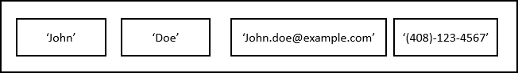

# 1. Record
## Overview of PL/SQL Record



- pl/sql record 는 여러 필드로 구성된 복합 데이터 구조로 각각 고유 값을 가지고 있다.
- 위 그림은 first name, last name, email, phone number 를 가지는 예시 record 이다.
- pl/sql record 는 필드 수준에서 레코드 수준 으로 작업을 전환하여 코드를 단순화하는데 도움을 준다.
- pl/sql 은 총 3가지 유형의 레코드를 가진다
    - 1. table-based
    - 2. cursor-based   
    - 3. programmer-defined 
- record 를 사용하기 전 반드시 선언이 우선시 되어야 한다.

## Declaring records
### Table-based record
```oracle-sql
DECLARE
   record_name table_name%ROWTYPE;
```
- 테이블 기반 record 에는 테이블의 열에 해당하는 각 필드가 있다.

### Cursor-based record
```oracle-sql
DECLARE
    record_name cursor_name%ROWTYPE;
```
- 명시적(explicit) 커서가 있는 특성을 사용한다.
```oracle-sql
DECLARE
    CURSOR c_contacts IS
        SELECT first_name, last_name, phone
        FROM contacts;
    r_contact c_contacts%ROWTYPE;
```
- 명시적(explicit) 커서와 동일한 구조의 레코드를 선언한다.
- 1. contacts 테이블의 first_name, last_name, phone 컬럼에서 데이터를 가져오는 명시적(explicit) 커서를 선언한다.
- 2. r_contact 라는 record 를 선언하는데 구조가 c_contacts 커서와 동일하다.

### Programmer-defined record
- 테이블 기반 및 커서 기반 레코드는 기존 구조를 기반으로 레코드를 만들어야 하는 경우 충분합니다.
- 기존 구조를 기반으로 하지 않는 구조의 레코드를 생성하려면 프로그래머 정의 레코드를 사용합니다.
- 프로그래머 정의 레코드를 선언하려면 다음 단계를 사용합니다.
1. 레코드에 원하는 구조를 포함하는 레코드 유형을 정의하십시오. 
2. 레코드 유형에 따라 레코드를 선언합니다.
```oracle-sql
TYPE record_type IS RECORD (
    field_name1 data_type1 [[NOT NULL] := | DEFAULT default_value],
    field_name2 data_type2 [[NOT NULL] := | DEFAULT default_value],
    ...
); 
```
- 다음은 레코드 유형을 정의하는 구문을 보여줍니다.
```oracle-sql
record_name record_type;
```
- 미리 정의된 레코드 유형을 기반으로 레코드를 선언할 때 위 구문을 사용한다.
```oracle-sql
DECLARE
  -- define a record type
TYPE r_customer_contact_t
IS
  RECORD
  (
    customer_name customers.name%TYPE,
    first_name    contacts.first_name%TYPE,
    last_name     contacts.last_name%TYPE );
  -- declare a record
  r_customer_contacts r_customer_contact_t;
BEGIN
  NULL;
END; 
```


## Referencing a record’s field
```oracle-sql
record_name.field_name
```
- 점 표기법을 통해 레코드의 필드를 참조합니다
```oracle-sql
r_contact.first_name
```
- r_contact 의 first_name 을 참조하는 예시이다.

## Assigning records
```oracle-sql
r_contact1 := r_contact2;
```
- 동일한 유형의 다른 레코드에 레코드를 할당할 수 있다.
```oracle-sql
IF r_contact1 = r_contact2 THEN
    ...    
END IF; 
```
- 그러나 동일한 유현의 두 레코드를 비교할 수는 없습니다
- 위 쿼리는 잘못된 비교입니다.
```oracle-sql
IF r.contact1.first_name = r.contact2.first_name AND 
    r.contact1.last_name = r.contact2.last_name AND
    r.contact1.phone = r.contact2.phone THEN
    ...
END IF;
```
- 레코드 비교를 원한다면 위 코드와 같이 개별 필드를 비교해야 한다.
```oracle-sql
r_contact.first_name := 'John';
r_contact.last_name := 'Doe';
r_contact.phone := '(408-654-2865)';
```
- 위 쿼리와 같이 레코드의 개별 필드에 값을 할당할 수 있다.
```oracle-sql
SELECT
  first_name, last_name, phone
INTO
  r_contact
FROM
  contacts
WHERE
  contact_id = 100;
```
- select into 를 전체 rocord 혹은 individual fields 에 사용할 수 있다.
```oracle-sql
-- fetch a whole record
FETCH cur_contacts INTO r_contact;

-- fetch individual fields
FETCH
  cur_contacts
INTO
  r_contact.first_name, 
  r_contact.last_name, 
  r_contact.phone;
```
- 전체 record 나 individual fields 를 FETCH INTO 할 수 있다.

## Records and INSERT / UPDATE statements
- 특정 field 들 없이 %ROWTYPE 를 사용한 record 를 통해 테이블에 new row 를 insert 할 수 있다.
```oracle-sql
CREATE TABLE persons  (
    person_id NUMBER GENERATED BY DEFAULT AS IDENTITY,
    first_name VARCHAR2( 50 ) NOT NULL, 
    last_name VARCHAR2( 50 ) NOT NULL,
    primary key (person_id)
);
```
- 테스트 용으로 person 테이블을 만든다.
```oracle-sql
DECLARE
  r_person persons%ROWTYPE;

BEGIN
  -- assign values to person record
  r_person.person_id  := 1;
  r_person.first_name := 'John';
  r_person.last_name  := 'Doe';

  -- insert a new person
  INSERT INTO persons VALUES r_person;
END; 
```
- %ROWTYPE 를 사용하여 persons 테이블에 new row 를 insert 한다.
```oracle-sql
DECLARE
  r_person persons%ROWTYPE;

BEGIN
  -- get person data of person id 1
  SELECT * INTO r_person 
  FROM persons 
  WHERE person_id = 1;

  -- change the person's last name
  r_person.last_name  := 'Smith';

  -- update the person
  UPDATE persons
  SET ROW = r_person
  WHERE person_id = r_person.person_id;
END;
```
- %ROWTYPE record 에서 row 를 update 하기 위해 SET TOW 키워드를 사용할 수 있다.

## Nested record
- 레코드는 다른 레코드인 필드를 포함할 수 있다.
- 레코드 중첩은 프로그램 데이터를 구조화하고 코드의 복잡성을 숨기는 강력한 방법이다.
```oracle-sql
DECLARE
  TYPE address IS RECORD (
    street_name VARCHAR2(255),
    city VARCHAR2(100),
    state VARCHAR2(100),
    postal_code VARCHAR(10),
    country VARCHAR2(100)
  );
  TYPE customer IS RECORD(
      customer_name VARCHAR2(100),
      ship_to address,
      bill_to address
  );
  r_one_time_customer customer;
BEGIN

  r_one_time_customer.customer_name := 'John Doe';
  -- assign address
  r_one_time_customer.ship_to.street_name := '4000 North 1st street';
  r_one_time_customer.ship_to.city := 'San Jose';
  r_one_time_customer.ship_to.state := 'CA';
  r_one_time_customer.ship_to.postal_code := '95134';
  r_one_time_customer.ship_to.country := 'USA';
  -- bill-to address is same as ship-to address
  r_one_time_customer.bill_to := one_time_customer.ship_to;
END;
```
- address 라는 record type 을 선언한다.
- customer record type 은 ship_to, bill_to 2개의 필드를 가지고 각각 address record type 이다.
