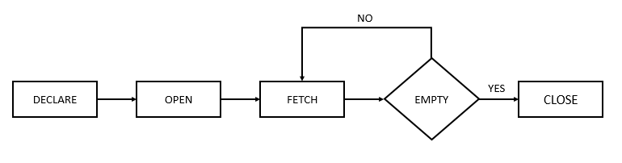

# 1. Cursor
- cursor 는 쿼리의 결과를 가리키는 포인터 이다
- pl/sql 는 2가지 타입의 cursor 가 있다
  - implicit cursors
  - explicit cursors
    
## Implicit cursors
- 오라클은 select into, insert, update, delete 와 같은 SQL 문을 실행 할 때 자동으로 implicit cursor 를 생성한다.
- 오라클은 내부적으로 implicit cursors 의 execution cycle 전체를 관리한다.
- 그후 SQL%ROWCOUNT, SQL%ISOPEN, SQL%FOUND, SQL%NOTFOUND 같은 커서의 정보 및 상태만 표시한다.
- implicit cursor 는 NO_CATA_FOUND 나 TOO_MANY_ROWS 각각의 예외를 발생시키는 0, 혹은 multiple rows 반환 쿼리 사용시 not elegant 하다

## Explicit cursors
- Explicit cursors 는 현재 블록 또는 패키지 사양의 선언 섹션에서 명시적으로 선언된 SELECT 문이다.
- Explicit cursors 는 실행 cycle 을 OPEN, FETCH, CLOSE 를 통해 control 해야 한다.
- Oracle은 SQL 문을 실행하고 이를 커서와 연관시켜 전체 실행 주기를 정의한다.




## Declare a cursor
```oracle-sql
CURSOR cursor_name IS query;
```
- 블록 또는 패키지의 선언 섹션에서 explicit cursor 를 선언한다.
- 1. CURSOR 키워드 뒤에 커서 이름을 지정한다.
- 2. IS 키워드 다음에 데이터를 가져오는 쿼리를 정의한다.


## Open a cursor
```oracle-sql
OPEN cursor_name;
```
- cursor 에서 fetching rows 를 하지 전에 cursor 를 open 해야 한다.
- cursor_name 은 declaration section 에서 선언한 cursor 의 이름이다.
- cursor 를 open 할 때 오라클은 parses the query, binds variables, executes the associated SQL statement 를 수행한다.
- 오라클은 또한 실행 계획을 경정하고 host varible, cursor parameters 를 SQL 문의 placeholders 와 연결하고, result set 를 결정하고, cursor 를 result set 의 첫번째 row 로 설정한다.

## FETCH from a cursor
```oracle-sql
FETCH cursor_name INTO variable_list;
```
- fetch 는 형재 행의 내용을 변수에 배치한다.
- 결과 집합의 모든 행을 검색하려면 마지막 행까지 각 행을 가져와야 한다.

## Closing a cursor
```oracle-sql
CLOSE cursor_name;
```
- 커서를 닫으면 오라클이 적절한 시간에 할당된 메모리를 해제한다.
- anonymous block, procedure, function 에서 cursor 를 선언한 경우, objects end 가 실행될 때 자동으로 커서가 닫힌다.
- 하지만 package-based cursors 는 반드시 explicitly 하게 close 해야 한다.
- 만약 아직 열리지 않은 커서를 닫으려 한다면 오라클은 INVALID_CURSOR 예외를 raise 한다.

## Explicit Cursor Attributes
```oracle-sql
cursor_name%attribute
```
- cursor 는 reference 할 수 있는 4개의 attribute 를 가지고 있다.
- cursor_name 은 explicit cursor 의 이름이다. 
1. %ISOPEN
This attribute is TRUE if the cursor is open or FALSE if it is not.

2. %FOUND
- 4개의 values 를 가지고 있다.
  - `NULL` before the first fetch
  - `TRUE` if a record was fetched successfully
  - `FALSE` if no row returned
  - `INVALID_CURSOR` if the cursor is not opened
3. %NOTFOUND
- 4개의 values 를 가지고 있다.
  - `NULL` before the first fetch
  - `TRUE` if a record was fetched successfully
  - `FALSE` if no row returned
  - `INVALID_CURSOR` if the cursor is not opened
4. %ROWCOUNT
- %ROWCOUNT 는 커서에서 가져온 행의 수를 반환한다.
- 커시가 open 되지 않은 경우 INVALID_CURSOR 를 반환한다.

## PL/SQL cursor example


```oracle-sql
CREATE VIEW sales AS
SELECT customer_id,
       SUM(unit_price * quantity) total,
       ROUND(SUM(unit_price * quantity) * 0.05) credit
FROM order_items
INNER JOIN orders USING (order_id)
WHERE status = 'Shipped'
GROUP BY customer_id;
```
- customers 기준 sales revenues 를 반환하는 view 를 만든다.
- credit 값은 total sales revenues 의 5% 이다
- 다음과 같은 anonymous block 을 만들어야 한다고 가정해 보자
- 1. 모든 고객의 credit limit 을 0 으로 재설정한다
- 2. sales 로 정렬된 customer 을 내림차순으로 가져와 100백만 예산에서 new credit limit 를 제공한다.

```oracle-sql
DECLARE
  l_budget NUMBER := 1000000;
   -- cursor
  CURSOR c_sales IS
  SELECT  *  FROM sales  
  ORDER BY total DESC;
   -- record    
   r_sales c_sales%ROWTYPE;
BEGIN

  -- reset credit limit of all customers
  UPDATE customers SET credit_limit = 0;

  OPEN c_sales;

  LOOP
    FETCH  c_sales  INTO r_sales;
    EXIT WHEN c_sales%NOTFOUND;

    -- update credit for the current customer
    UPDATE 
        customers
    SET  
        credit_limit = 
            CASE WHEN l_budget > r_sales.credit 
                        THEN r_sales.credit 
                            ELSE l_budget
            END
    WHERE 
        customer_id = r_sales.customer_id;

    --  reduce the budget for credit limit
    l_budget := l_budget - r_sales.credit;

    DBMS_OUTPUT.PUT_LINE( 'Customer id: ' ||r_sales.customer_id || 
' Credit: ' || r_sales.credit || ' Remaining Budget: ' || l_budget );

    -- check the budget
    EXIT WHEN l_budget <= 0;
  END LOOP;

  CLOSE c_sales;
END;
```
- 어우 복잡해...
- 하나씩 분석해 보자....
```oracle-sql
DECLARE
  l_budget NUMBER := 1000000;
   -- cursor
  CURSOR c_sales IS
  SELECT  *  FROM sales  
  ORDER BY total DESC;
   -- record    
   r_sales c_sales%ROWTYPE;
```
- 선언문 부분이다
- 총 3개의 변수를 선언한다.
- 1. l_budget 변수에 1,000,000 값이 초기화 되어 있다.
- 2. sales view 에서 데이터를 가져오는 select 문이 c_sales 라는 explicit cursor 변수에 담겨있다.
- 3. 지막으로 r_sales 라는 cursor-based record 변수가 있다.
- 실행부분에서는 다음과 같은 일들이 발생한다
- 1. update 구문을 이용하여 모든 customers 의 credit limits 을 0 으로 reset 한다
- 2. c_sales 커서를 open 한다
- 3. cursor 에서 each row 를 fetch 한다.
- 4. 각 loop 반복에서 credit limit 을 update 하고 budget 을 감소시킨다.
- 5. 더이상 fetch 할 row 가 없거나 budget 이 전부 고갈되면 loop 가 종료된다.
- 6. 마지막으로 cursor 를 close 한다.

```oracle-sql
SELECT customer_id,
       name,
       credit_limit
FROM customers
ORDER BY credit_limit DESC;

```
- 다음 구문을 통해 customer 들의 credit_limit 이 어떻게 업데이트 되었는지 확인해 보자
```oracle-sql
SELECT
  SUM( credit_limit )
FROM
  customers; 
```
- 다음 구문을 통해 전체 credit limit 합이 1,000,000 인것을 알 수 있다.


