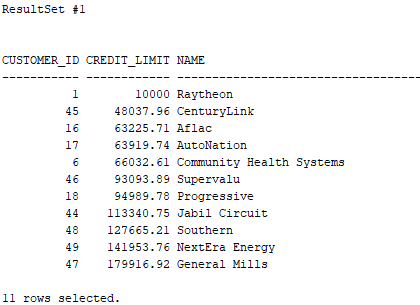
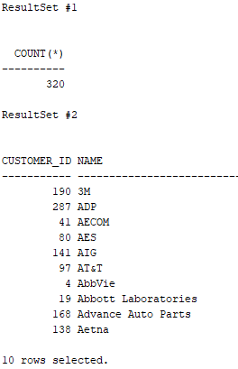
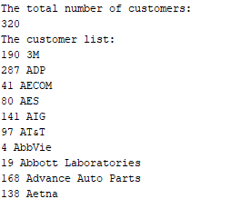

# 2. Implicit statement results
- implicit statement results 를 사용한 stored procedure 를 통해 1개 이상의 result sets 를 반환하는 법을 배운다.
- 오라클 12c 에서 OUT REF CURSOR 파라미터를 통해 stored procedure 로부터 result set 를 반환할 수 있다.
- 다른 DB 를 오라클 DB 로 쉽게 migration 하기 위해, 오라클 12c 는 implicit statement 라는 새로운 feature 를 추가하였다.
- 이는 dbms_sql 패키지를 사용하여 stored procedure 에서 1개 이상의 result set 를 반환해준다.


## Returning a single result set
```oracle-sql
CREATE OR REPLACE PROCEDURE get_customer_by_credit(
    min_credit NUMBER
)
AS 
    c_customers SYS_REFCURSOR;
BEGIN
    -- open the cursor
    OPEN c_customers FOR
        SELECT customer_id, credit_limit, name
        FROM customers
        WHERE credit_limit > min_credit
        ORDER BY credit_limit;
    -- return the result set
    dbms_sql.return_result(c_customers);
END;
```
- 특정 credit 보다 더 큰 credit limit 를 가지는 customer 를 반환하는 stored procedure 을 만든다.
- 이 stroed procedure 에서는
- 1. SYS_REFCURSOR 타입의 cursor 를 declaration section 에서 선언한다.
- 2. 쿼리와 관련된 cursor 를 open 한다
- 3. dbms_sql.return_result() 함수를 사용하여 cursor 를 argument 로 받고 result set 를 반환한다.
```oracle-sql
EXEC get_customer_by_credit(5000);
```
- 해당 stored procedure 를 execute 한다.



 ## Returning multiple result sets
```oracle-sql
CREATE OR REPLACE PROCEDURE get_customers(
    page_no NUMBER, 
    page_size NUMBER
)
AS
    c_customers SYS_REFCURSOR;
    c_total_row SYS_REFCURSOR;
BEGIN
    -- return the total of customers
    OPEN c_total_row FOR
        SELECT COUNT(*)
        FROM customers;
    
    dbms_sql.return_result(c_total_row);
    
    -- return the customers 
    OPEN c_customers FOR
        SELECT customer_id, name
        FROM customers
        ORDER BY name
        OFFSET page_size * (page_no - 1) ROWS
        FETCH NEXT page_size ROWS ONLY;
        
    dbms_sql.return_result(c_customers);    
END;
```
- page no, page size 로 지정된 페이지로 customer result 를 반환하는 stored procedure 를 만든다.
- customers 테이블의 전체 rows 를 반환한다.
```oracle-sql
EXEC get_customers(1,10)
```
- 해당 프로시저를 실행한다.



- 2개의 result set 를 반환한다.

## Using the get_next_result() procedure
- 일반적으로 Java 와 같은 클라이언트 프로그밍 언어를 사용하여 프로시저에서 반환된 결과 집합을 처리한다.
- 그러나 PL/SQL 를 사용하여 결과집합을 처리하는 경우 DBMS_SQL 패키지에 있는 get_next_resultset() 프로시저를 사용한다.
```oracle-sql
SET SERVEROUTPUT ON

DECLARE
l_sql_cursor    PLS_INTEGER;
c_cursor        SYS_REFCURSOR;
l_return        PLS_INTEGER;

l_column_count  PLS_INTEGER;
l_desc_tab      dbms_sql.desc_tab;

l_total_rows    NUMBER;
l_customer_id   customers.customer_id%TYPE;
l_name          customers.NAME%TYPE;
BEGIN
-- Execute the function.
l_sql_cursor := dbms_sql.open_cursor(treat_as_client_for_results => TRUE);

dbms_sql.parse(C             => l_sql_cursor,
                STATEMENT     => 'BEGIN get_customers(1,10); END;',
                language_flag => dbms_sql.NATIVE);

l_return := dbms_sql.EXECUTE(l_sql_cursor);

-- Loop over the result sets.
LOOP
    -- Get the next resultset.
    BEGIN
    dbms_sql.get_next_result(l_sql_cursor, c_cursor);
    EXCEPTION
    WHEN no_data_found THEN
        EXIT;
    END;

    -- Get the number of columns in each result set.
    l_return := dbms_sql.to_cursor_number(c_cursor);
    dbms_sql.describe_columns (l_return, l_column_count, l_desc_tab);
    c_cursor := dbms_sql.to_refcursor(l_return);

    -- Handle the result set based on the number of columns.
    CASE l_column_count
    WHEN 1 THEN
        dbms_output.put_line('The total number of customers:');
        FETCH c_cursor
        INTO  l_total_rows;

        dbms_output.put_line(l_total_rows);
        CLOSE c_cursor;
    WHEN 2 THEN
        dbms_output.put_line('The customer list:');
        LOOP
        FETCH c_cursor
        INTO  l_customer_id, l_name;

        EXIT WHEN c_cursor%notfound;

        dbms_output.put_line(l_customer_id || ' ' || l_name);
        END LOOP;
        CLOSE c_cursor;
    ELSE
        dbms_output.put_line('An error occurred!');
    END CASE;
END LOOP;
END;
/
```
- get_customers() 프로시저를 호출하는 anonymous block 이다
- get_next_resultset() 프로시저를 사용하여 result sets 를 처리한다.
- get_customers() 는 multiple result sets 를 반환하기 때문에 columns 의 개수를 기반으로 result sets 를 handle 한다.



