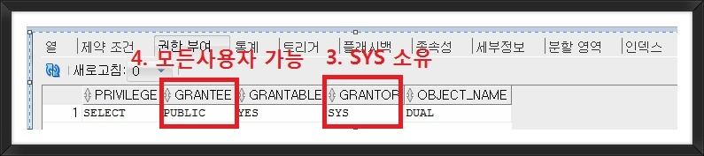
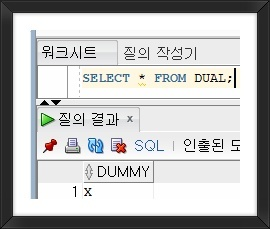

# dual
- 오라클 자체에서 제공되는 테이블
- 간단하게 함수를 이용해서 계산 결과값을 확인 할 떄 사용하는 테이블
- SYS 사용자가 소유하는 오라클의 표준 테이블
- SYS 사용자가 소유하지만 어느 사용자에서나 접근 가능하다
- 오직 한행, 한 컬럼을 담고 있는 dummy 테이블 이다





## 용도
- dual 테이블은 사용자가 함수(계산)을 실행할 때 임시로 사용하기 적합하다
- 함수에 대한 쓰임을 알고 싶을때 특정 테이블을 생성할 필요없이 dual 테이블을 이용하여 함수의 값을 리턴받을 수 있다.
- ex) `SELECT 시퀀스.NEXTVAL FROM DUAL;`
- ex) `SELECT SYSDATE FROM DUAL;`
- ex) `SELECT CURRENT_DATE FROM DUAL;`
- ex) `Merge into` 내부에서 사용
- 테이블 생성 없이 가상 테이터를 만들어 테스트 할 때도 사용가능
```oracle-sql
 SELECT  회원테이블.* 
FROM
        (
        SELECT '갓댐' AS 이름, 18 AS 나이 FROM DUAL
        UNION ALL
        SELECT '갓동수', 20 FROM DUAL
        UNION ALL
        SELECT '허준', 19 FROM DUAL
        ) 회원테이블
WHERE   나이 < 20;

```
- insert 할때도 활용 가능 
- 그냥 매우 무궁무진