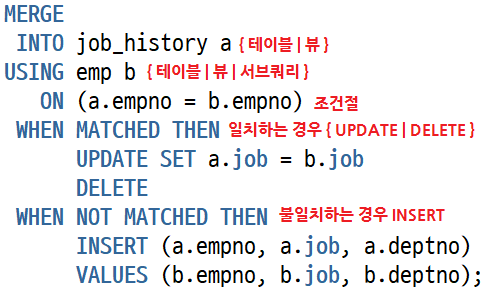

# Merge
- 하나의 쿼리문에서 insert, update, delete 작업을 해야 하는 경우가 있다
- merge 를 통해 간단하게 쿼리문을 작성할 수 있다.
- 오라클 9i 부터 merge 문을 사용할 수 있으면 delete 절은 10g 부터 사용할 수 있다.
- 데이터가 이미 존재하는 경우 update(delete 포함가능) 존재하지 않으면 insert 하여 테이블 row 출돌이 안나게 해준다.

## syntax
```oracle-sql
MERGE [ hint ]
   INTO [ schema. ] { table | view } [ t_alias ]
   USING { [ schema. ] { table | view } | subquery } [ t_alias ]
   ON ( condition )
WHEN MATCHED THEN
UPDATE SET column = { expr | DEFAULT }
           [, column = { expr | DEFAULT } ]...
[ DELETE where_clause ]
WHEN NOT MATCHED THEN
INSERT [ (column [, column ]...) ]
VALUES ({ expr [, expr ]... | DEFAULT })
```



## example
### merge example1
```oracle-sql
-- 부서번호 10, 20의 사원정보를 가지는 테스트 테이블을 생성하자 
CREATE TABLE emp_merge_test 
AS SELECT empno, deptno, sal FROM emp WHERE deptno IN (10, 20);
 
 
-- 데이터를 확인해 보자
SELECT * FROM emp_merge_test; 
 
 
-- 사원이 존재하면 급여를 10% 인상하고, 없으면 INSERT 한다.
MERGE INTO emp_merge_test m
USING ( SELECT empno, deptno, sal    -- USING절에 뷰가 올수 있다.
        FROM emp 
        WHERE deptno IN (20,30)) e
ON ( m.empno = e.empno)
WHEN MATCHED THEN
  UPDATE SET m.sal = ROUND(m.sal*1.1)
WHEN NOT MATCHED THEN
INSERT (m.empno, m.deptno, m.sal)
VALUES (e.empno, e.deptno, e.sal)
WHERE e.sal > 1000                 -- INSERT 절의 조건절도 지정이 가능하다
COMMIT;
 
 
-- 20부서의 급여가 10%증가했고, 30부서는 등록되었는지 확인해 보자
SELECT * FROM emp_merge_test;
 
 
-- 다음 테스트를 위해서 emp_merge_test 테이블에 30부서 데이터를 삭제하자
-- 부서번호 10과 20의 사원정보만 남을 것이다. 
DELETE FROM emp_merge_test WHERE deptno = 30;
COMMIT;
```
- 부서번호 20,30의 사원이 존재하면 급여를 10% 인상하고, 존재하지 않으면 급여가 1000보다 큰 사원정보를 등록하는 예이다. (INSERT, UPDATE 예제)

### merge example 2
```oracle-sql
-- 30 부서가 삭제되었는지 확인한다.
SELECT * FROM emp_merge_test;
 
 
-- MERGE 문 작성
MERGE INTO emp_merge_test m
USING emp e
ON (m.empno = e.empno)
WHEN MATCHED THEN
  UPDATE SET m.sal = ROUND(m.sal*1.1)
  DELETE WHERE (m.deptno = 20)   -- 부서번호 20의 사원정보는 삭제.
WHEN NOT MATCHED THEN
INSERT (m.empno, m.deptno, m.sal)
VALUES (e.empno, e.deptno, ROUND(e.sal*1.2));
COMMIT;
 
 
-- 정상적으로 변경되었는지 확인해 보자
SELECT * FROM emp_merge_test;
 
 
-- 테스트 테이블은 삭제하자
DROP TABLE emp_merge_test;
```
- 부서번호 10의 사원 급여를 10% 인상하고, 부서번호 20의 사원정보는 삭제하며, 부서번호 30의 사원 급여를 20% 인상하는 예이다. (INSERT, UPDATE, DELETE 예제)

### 그외 다양한 예시
[다양한 예시 사이트](https://gent.tistory.com/406)