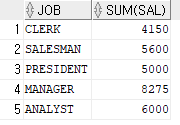
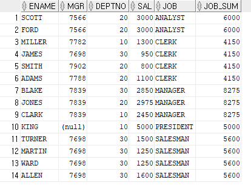

# partition by
- group by 의 대체제라 생각할 수 있다.
- aggregate function(집계 함수) 와 함께 쓰인다.
  - SUM, AVG, MAX, MIN, COUNT

## group by 와의 차이점
- Group by : 특정 원하는 컬럼에 대해서 추출이 가능하나, 전체 데이터에서 원하는 결과값을 보여주기가 힘들다
- Partition By : 전체 데이터에서 원하는 결과값을 보여줄 수 있다.

## Example
```oracle-sql
select job, sum(sal)
from emp
group by job;
```


- 전체 데이터 추출이 어렵다
- 그룹별 요청 데이터 추출이 가능하나, 전체 데이터에서 원하는 결과값을 보여주지는 못한다. 

```oracle-sql
select ename, mgr, deptno, sal, job, sum(sal) over(partition by job) job_sum
from emp;
```


- 전체데이터에서 특정쿼리를 추가하지 않으면서 sal 의 sum 값(job 기준)을 구할 수 있다.
- job 종류 별 salary 의 전체 합

## 응용 example
### deptno 종류 별 salary 전체 평균
```oracle-sql
select deptno, avg(sal)
from emp
group by deptno;
```
```oracle-sql
select ename, mgr, deptno, sal, job, avg(sal) over(partition by deptno) deptno_avg
from emp;
```

### job 종류별 salary 가장 높은 값
```oracle-sql
select job, max(sal)
from emp
group by job;
```
```oracle-sql
select ename, mgr, deptno, sal, job, max(sal) over(partition by job) job_max
from emp;
```

### deptno 종류 별 salary 가장 낮은 값
```oracle-sql
select depto, min(sal)
from emp
group by deptno;
```
```oracle-sql
select ename, mgr, deptno, sal, job, min(sal) over(partition by deptno) deptno_min
from emp;
```


## 참고사이트
https://jjongdiary.tistory.com/79