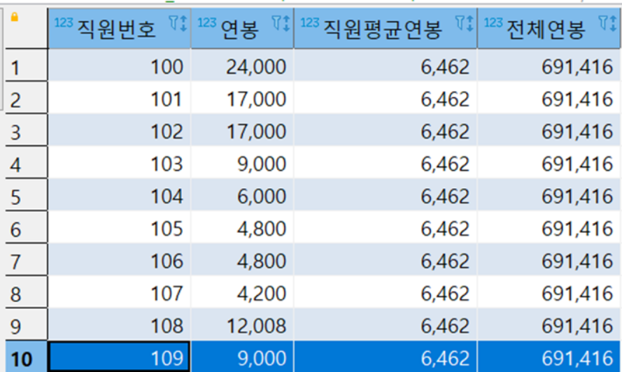
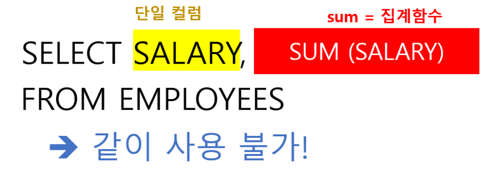
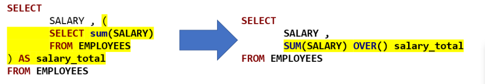
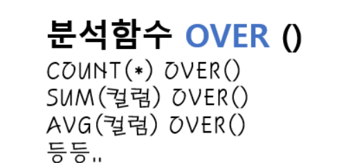

# Over
- 평균, 총합 등 데이터를 통계나 집계로 집계할 때
- 단일함수랑 집계함수랑 같이 올 수 없어 서브쿼리를 사용한다
- 다수의 집계결과가 필요할 때 여러 서브쿼리와 그룹바이로 인해 쿼리가 지저분해진다
- 이를 간단하게 만들어주는 절이 OVER 절이다.

## Prepare
```oracle-sql
create table temp_emp
(
empno number,
year_sal number
)

insert into temp_emp(empno, year_sal)
select 100,24000 from dual
union all
select 101,17000 from dual
union all
select 102,17000 from dual
union all
select 103,9000 from dual
union all
select 104,6000 from dual
union all
select 105,4800 from dual
union all
select 106,4800 from dual
union all
select 107,4200 from dual
union all
select 108,12008 from dual
union all
select 109,9000 from dual
```


## 단일함수랑 집계함수는 같이 올 수 없다?


- 집계함수는 단일함수, 집계되지 않은 컬럼과 같이 사용할 수 없다.
- 결국 서브쿼리로 평균과 합계 데이터를 뽑아야 한다.
```oracle-sql
SELECT
    EMPNO 직원번호,
    YEAR_SAL 연봉,
    ROUND((
        SELECT AVG(YEAR_SAL)
        FROM TEMP_EMP
    )) AS 직원평균연봉,
    (
        SELECT SUM(YEAR_SAL)
        FROM TEMP_EMP
    ) AS 전체연봉
FROM TEMP_EMP; 
```
- over 절을 사용하면 매번 서브쿼리를 만들필요 없이 간단하게 줄일 수 있다.
```oracle-sql
SELECT 
    EMPNO 직원번호,
    YEAR_SAL 연봉,
    ROUND(AVG(YEAR_SAL) OVER()) 직원평균연봉,
    SUM(YEAR_SAL) OVER() 전체연봉
FROM TEMP_EMP; 
```


## OVER 절 문법/사용법

- 집계 함수와 함께 사용된다.
- SUM(SCORE) OVER() 은 전체 점수의 합계가 될것이고
- AVG(SCORE) OVER() 은 평균 점수가 될 것이다
- 주의해야할 점은 OVER 절은 FROM, WHERE, GROUP BY, HAVING 절 이후에 계산된다.
```oracle-sql
SEELCT EMPNO, COUNT(*) OVER() 직원수, SUM(YEAR_SAL) OVER() 총연봉
FROM TEMP_EMP E
WHERE JOB_ID = 'IT_PROG'; 
```
- 위 코드는 전체직원의 직원수와 총연봉이 아닌 job_id 가 it_prog 인 사람들의 직원수와 총연봉을 구하게 된다.

## OVER 절 괄호안의 구문


- over() 와 같이 괄호안에 아무것도 없이 사용할 수 있다.
- over(partition by 컬럼) 과 같이 조건을 주기위한 절을 추가할 수 있다.
  - partition by 는 group by 를 over 절에서 사용하고 싶을때
  - order by 는 말그대로 정렬조건을 주고 싶을 때
  - 세부분할기준(windowing clause) 는 이외에 추가적인 분할조건을 주고 싶을 때 사용한다.

```oracle-sql
-- ###### over 절 없이 ###### 
SELECT E1.EMPNO, E1.JOB_ID,
    (
        SELECT SUM(YEAR_SAL)
        FROM TEMP_EMP
    ) 전체총합, 직무별총합
FROM TEMP_EMP E1,
    (
        SELECT JOB_ID, SUM(YEAR_SAL) AS 직무별총합
        FROM TEMP_EMP
        GROUP BY JOB_ID
        ORDER BY JOB_ID
    ) E2
WHERE E1.JOB_ID = E2.JOB_ID;
```
```oracle-sql
-- ###### over 절 사용 ###### 
SELECT EMPNO, JOB_ID,
        SUM(YEAR_SAL) OVER() 전체총합,
        SUM(YEAR_SAL) OVER(PARTITION BY JOB_ID ORDER BY JOB_ID) 직무별총합
FROM TEMP_EMP E;
```
- over 를 활용하여 쿼리를 더 깔끔하고 간단하게 만들 수 있다.

